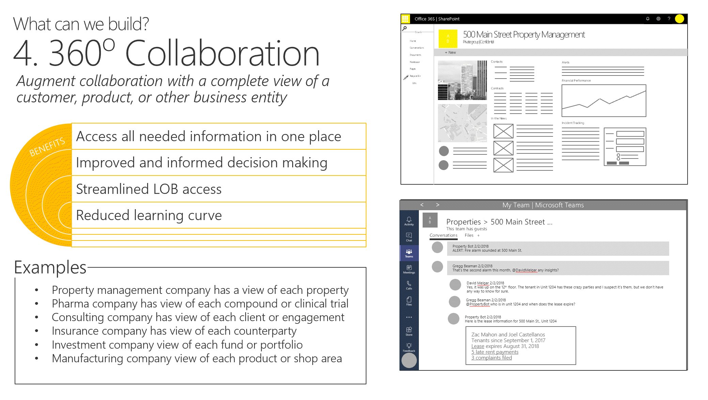

# 360 Degree Collaboration in Microsoft Teams

I'm pleased to announce the release of a new SPFx sample, which shows how to build a mash-up of related information in a Teams tab. The chosen business scenario is a team of people who need to visit customer sites, however the technical approach could be used for any kind of mash-up. Users can click on a Teams tab to see what customer visits are approaching for each team member. When a visit is selected, the solution displays:
 * customer information (from the Northwind database)
 * documents (from SharePoint)
 * recent transactions (mock)
 * a map (Bing maps)
 * current weather (Open Weather Map)
 * photos (from SharePoint)
 * a text box for sending messages to the Teams channel with deep links back to the selected visit

The solution demonstrates:

 1. A Teams tab using SharePoint Framework and React displaying "mashup" of related information (explained in this article)
 2. Accessing the hosting Team using the teams context and the Graph API (explained [in this article](#))
 3. Deep linking to a SharePoint Framework tab (explained [in this article](#))

This solution was originally created for the SharePoint Developer Kitchen in Bellevue, WA during the summer of 2018. I was asked to come up with a demonstration that would spur ideas for others writing tabs for Microsoft Teams, and this is the result. It was subsequently included in the Teams Solution Developer Workshops presented by Microsoft's One Commercial Partner organization to partners around the world.

This is currently POC quality code,but with an eye to evolving it into a production quality solution. Thus, the architecture is designed for maintenance and growth, but some data is still mocked and it still lacks production-level features such as thorough exception handling and unit testing.

This article will describe the solution architecture, and the solution pattern upon which the sample is based.

## The 360 Degree Pattern

For some time now, I've been working on identifying common patterns for "collaborative applications" - that is, applications which are embedded in collaboration tools such as Microsoft Teams or SharePoint. This started when I was working at the Microsoft Technology Center in Boston, where I helped envision and design hundreds of enterprise solutions with Microsoft customers and partners. After a while I started to notice patterns in the solutions, and this is one of the more popular ones. Note I didn't _invent_ the pattern, I just unofficially named it; it was invented over and over by customers across many industries.

The 360 degree collaboration pattern is useful when a group of people need to view all aspects of business entities while they're collaborating. It almost always takes the form of a mashup or dashboard embedded right into the collaboration tools where people are working. Here are some examples:

* A property management company has a 360 degree view of each **property** under management. In one place they can find all the documents relating to a property (purchase documents, legal documents, leases, etc.); contact information for everyone who works on the property, photos, maps, floor plans, and charts showing the property's financial performance
* An insurance company has a 360 degree view of each **counterparty** they work with, including parent companies and subsidiaries, related documents, underwriters, news stories, SEC filings, and contacts
* A consulting company has a 360 degree view of each **client** and consulting **project**, including all documentation, team member and client contact information, current budget and accounts receivable, billed hours and forecast, news articles relating to the client company, and a search-driven display of similar projects
* A pharmaceutical company has a 360 degree of each **compound**, including links to all documentation, clinical trial assets, contacts, approved uses and disease indications, and financial performance
* A mutual funds company has a 360 degree view of each **fund** including the fund management team, portfolio details, disclosures, legal documents, contact information for the management team, and financial performance

The list goes on and on; there are examples in every industry.

What distinguishes the 360 degree pattern is a display that shows consolidated information about a **single business entity** (the 360 degree part), and that it's used as part of a collaborative process (the collaboration part). If the display shows information not relating to the business entity (for example, the user's personal calendar or a list of team resources) then it's just a mashup, and not the 360 degree pattern.

These solutions always include some way of determining which business entity is in view. Sometimes this is implied by the location of the display - for example, if there's a SharePoint site for each product a manufacturer produces, it's natural to display a 360 degree view of each product in the product's site. The typical approach is to store information about the related business entity in the collaborative workspace; the code reads this to decide what information to display. For example, a product ID might be stored in a hidden SharePoint list within each product site; a web part in each site reads this and uses it to gather the information to display.

In other cases, some kind of selector is needed. In the demo solution, the business entity is a customer visit, and many visits are handled by a team. Thus, the solution includes a selector (in the form of a tab and calendar for each team member); when a customer visit (the business entity) is selected, the details appear.

## Solution Architecture

The solution is a single SharePoint Framework web part written in React. It might be tempting to build this as a set of connected web parts using [Dynamic Data](#); this would allow modifying the display by adding or re-arranging the web parts, and it would make each web part reusable in other scenarios. However Microsoft Teams' tabs allow only one web part, which is more or less a single-page application. Thus, instead of a set of web parts, the solution is implemented as a set of React components and services.

The [models](#) folder contains an interface for each of the shared data structures used in the solution. Most notable are ICalendarItem (contains the information about an item in the Teams shared calendar) and ICustomer (contains the information about a customer in the Northwind database). IVisit is a combination of an ICalendarItem and an ICustomer, and indicates a visit to a customer at a given date and time.

Here are the React components:

**[FieldVisits.tsx](#)** - This is the main component that displays the entire mashup. It displays the [UserTabs](#) at the top, and handles the selection of users. When a user is selected, it populates the [VisitList](#) component with customer visits for that user. When a visit is selected, it displays all the components, passing information about the visit (mainly the customer ID) to each component.

FieldVisits handles all the selecting of user tabs and visits. In accordance with the React principle of [lifting up state](#), FieldVisits owns the overall state for the solution including the list of all visits and all users who have visits, the selected user and visits filtered for that user, and the selected visit that will be displayed in detail.

The React properties for FieldVisits include a reference to every service used by FieldVisits and all the components in the solution; FieldVisits passes each subcomponent the properties it needs (usually information about the customer associated with the selected visit), and the service references it needs to do its job.

FieldVisits uses the [calendar service](#) to obtain the list of visits, and the [customer service](#) to obtain additional information about the customer associated with each visit.

**[UserTabs.tsx](#)** - This component is provided a list of all users, and the selected user, in its properties, along with a callback to indicate a new user tab was selected. It displays the user tabs along the top of the display.

**[VisitList.tsx](#)** - This component is provided a list of all visits to be displayed, and the selected visit, in its properties, along with a callback to indicate a new visit was selected.

**[Activities.tsx](#)** - This component displays recent account activity for the customer passed in its properties. It uses the [Activities](#) service to obtain this information, which is currently limited to mock data.

**[CompanyInfo.tsx](#)** - This component displays information about the customer. No service is needed since all the needed information is stored in the ICustomer model.

**[Documents.tsx](#)** - Given a customer ID, this component displays a list of documents in SharePoint, obtained from the [Documents](#) service. The Documents service locates these documents within the SharePoint site associated with the Team, filtering by the customer ID field in a document library.

**[Map.tsx](#)** - Given a customer address, this component displays a Bing map using the [Map](#) service.

**[Photos.tsx](#)** - Given a customer ID, this component displays photos for that customer using the [Photos](#) service. The Photos service locates these images within the SharePoint site associated within a folder named with the customer ID. It's possible to create a Flow that will automatically route photos to the correct folder by looking at the user identity and the time the photo was taken, and figuring out which customer was visited by that user at that time.

**[Weather.tsx](#)** - Given a customer address, displays the current weather conditions using the [weather](#) service.

Within the Services folder, there's a subfolder for each Service that contains its interface, and in most cases a mock and real implementation. The [ServiceFactory](#) class provides references to each service, selecting mock or real versions on the web part environment as a sort of simple dependency injection.

## Building and Deploying the Solution

To build the solution and run it locally with mock data, follow these steps:

1. Clone the repository or otherwise download the solution code to a development machine set up for SharePoint Framework 1.8 development.
1. Obtain API keys for [Bing Maps](https://docs.microsoft.com/en-us/bingmaps/getting-started/bing-maps-dev-center-help/getting-a-bing-maps-key) and [Open Weather Maps](https://openweathermap.org/api). In src/webparts/fieldVisitTab/, copy constants.sample.ts to constants.ts and add the API keys.
1. Install the required dependencies and run the solution using these commands:

~~~bash
npm install
gulp serve
~~~

To work with real data, the web part requires content to be in place including:

* A Microsoft Team
* Calendar items in the Team's shared calendar, encoded with Northwind database customer IDs
* Documents and photos in SharePoint

[Detailed setup instructions are here](#).

## Acknowledgements

Many thanks to [Arbindo Chattopadhyay](https://www.linkedin.com/in/arbindoc/) for writing the [detailed installation instructions ](./documentation/setup.md). This was a big task I never seemed to find time to do; his help got me moving on formally releasing the demo to the public.

Thanks also to [Olga Gordon](#) and [???](#) for testing the build instructions and solution in their environments.