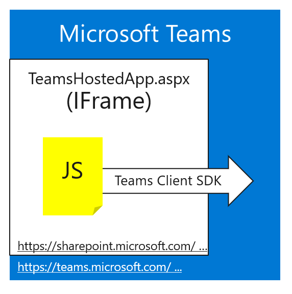

# Working with a Team from an SPFx Tab in Teams

This is part 2 of a 3-part article series about building a "360 degree view" mashup for Microsoft Teams using the SharePoint Framework and React. The articles are:

 1. A Teams tab using SharePoint Framework and React displaying "mashup" of related information [in Part 1 of the series](#)
 1. Accessing the hosting Team using the teams context and the Graph API (explained in this article)
 1. Deep linking to a SharePoint Framework tab (explained [in Part 3 of the series](#))

The series is based on a [sample Teams tab written in SharePoint Framework](https://github.com/SharePoint/sp-dev-fx-webparts/tree/master/samples/react-teams-tab-field-visit-mashup) which displays a mashup of information about customer visits.

## Getting from the Tab to the Team, and beyond

As you may have heard, the great new way to write custom tabs for Microsoft Teams is to use the SharePoint Framework. One giant web part makes a tab, and SharePoint takes care of hosting, single sign-on, configuration, and more.

To get started, follow this [tutorial](https://docs.microsoft.com/en-us/sharepoint/dev/spfx/web-parts/get-started/using-web-part-as-ms-teams-tab). It's a great start, but it might leave you wondering how to interact with the Team your tab is running in, like read its meeting calendar or post a message. This article will explain how you can do that and also unlock the entire Office 365 Group from your code.

## Two APIs are better than one

Well ... maybe?
Anyway, you need two API's to do the job. The first is the [Teams JavaScript client SDK](https://docs.microsoft.com/en-us/javascript/api/overview/msteams-client?view=msteams-client-js-latest). The second API is the Microsoft Graph. The Teams Client SDK will give you the Team ID (which is also the O365 Group ID), the channel ID, and more. Then you can use this information to call the Graph API.

Teams tabs run in IFrames, and a SharePoint Framework tab is no exception. IFrames are isolated, which is good for security, but sometimes they need to talk to their hosting web page - in this case Microsoft Teams. That's the job of the Teams Client SDK.

The Teams Client SDK sends inter-frame messages from your web part to the hosting Teams client, be it a web page or [Electron app](https://blog.thoughtstuff.co.uk/2017/04/under-the-hood-of-the-microsoft-teams-desktop-application/). It relays your requests across the otherwise impermeable wall between browser frames and gives you access to the context your tab is running in. It's also used to launch login pop-up windows, but SharePoint's single sign-on takes care of those details, so you can ignore that part of the SDK in the SharePoint Framework.

Here are the steps to access the Team conversation and calendar from a SharePoint Framework tab:

### Step 1: Get the Teams info with the Teams JavaScript Client

You can see this in the [Field visit tab web part](https://github.com/SharePoint/sp-dev-fx-webparts/blob/master/samples/react-teams-tab-field-visit-mashup/src/webparts/fieldVisitTab/FieldVisitTabWebPart.ts). First, import the Teams API:

~~~TypeScript
import * as microsoftTeams from '@microsoft/teams-js';
~~~

Then check carefully to see if you have the Teams Client SDK. `this.context.microsoftTeams` will be null on a SharePoint page, and will point to the Teams Client SDK if you're in Teams. This code, from the web part's `onInit()` method, checks for the Teams Client SDK, and if it's present, squirrels away the Teams info in private variables.

~~~TypeScript
    if (this.context.microsoftTeams &&
        this.context.microsoftTeams.getContext) {

      // Get configuration from the Teams SDK
    p = new Promise((resolve, reject) => {
      if (this.context.microsoftTeams &&
          this.context.microsoftTeams.getContext) {
          this.context.microsoftTeams.getContext(context => {
            this.teamsContext = context;
            this.groupName = context.teamName;
            this.groupId = context.groupId;
        this.channelId = context.channelId;
        resolve();
      });
    }
  });
}
~~~

### Step 2: Call the Graph API

To post into the channel the tab is running in, call the Graph API using the values from the Teams context. By this time, we're down in the [Conversation Service](https://github.com/SharePoint/sp-dev-fx-webparts/blob/master/samples/react-teams-tab-field-visit-mashup/src/webparts/fieldVisitTab/services/ConversationService/ConversationServiceTeams.ts), which has received the Team and channel ID from the [service factory](https://github.com/SharePoint/sp-dev-fx-webparts/blob/master/samples/react-teams-tab-field-visit-mashup/src/webparts/fieldVisitTab/services/ServiceFactory.ts) through constructor injection. The SharePoint Framework makes the Graph call easy - we don't need no stinking access tokens!

~~~TypeScript
this.context.msGraphClientFactory
    .getClient()
    .then((graphClient: MSGraphClient): void => {
        graphClient.api(`https://graph.microsoft.com/beta/teams/${this.teamId}/channels/${this.channelId}/chatThreads`)
        .post(message, ((err, res) => {
            resolve();
        }));
    });
~~~

Reading the calendar is about as easy. Since the Team ID is the same as the O365 Group ID, the [calendar service](https://github.com/SharePoint/sp-dev-fx-webparts/blob/master/samples/react-teams-tab-field-visit-mashup/src/webparts/fieldVisitTab/services/CalendarService/CalendarService.ts) only needs ask Graph to query the group calendar.

~~~TypeScript
this.context.msGraphClientFactory
    .getClient()
    .then((graphClient: MSGraphClient): void => {
        graphClient.api(`/groups/${groupId}/calendarview?startdatetime=${startDateTime}&enddatetime=${endDateTime}`)
        .get((error, data: CalendarView, rawResponse?: any) => {
            let calendarItems: ICalendarItem[] = [];
            data.value.forEach((event) => {
                // Do something with a calendar item
            });
        });
    });
~~~

The cool thing about it is that the calendar isn't in Teams, it's in Exchange Online where it can easily sync with Outlook. And through the power of the Microsoft Graph, you can get from Teams to Exchange with _one_ api call. If we had to call the Exchange API, that would be an extra DNS lookup and OAuth flow, and probably an extra call to map the Group ID to the calendar - but Graph does all that in one round trip to the service endpoint. 

> Did you know?
>
> The SPFx Graph Client is based on the [Microsoft Graph client library for JavaScript](https://github.com/microsoftgraph/msgraph-sdk-javascript). This open source library allows fluent Graph access from browser or server-side JavaScript. That means your services could easily be reused outside of SharePoint.

## Accessing SharePoint Data

Getting to the SharePoint site associated with the Team is even easier - that same SharePoint site is hosting your web part, so the [SharePoint REST API](https://docs.microsoft.com/en-us/sharepoint/dev/sp-add-ins/complete-basic-operations-using-sharepoint-rest-endpoints) is at your beck and call. Any HTTP client will work because you're already logged into SharePoint and have the necessary auth cookie. However it's best to use the framework's [SPHttpClient](https://docs.microsoft.com/en-us/javascript/api/sp-http/sphttpclient?view=sp-typescript-latest), which handles details like request digests in POSTs.

Here's a snippet from the [document service](https://github.com/SharePoint/sp-dev-fx-webparts/blob/master/samples/react-teams-tab-field-visit-mashup/src/webparts/fieldVisitTab/services/DocumentService/DocumentService.ts) which reads a list of documents tagged with a particular customer ID.

~~~TypeScript
this.context.spHttpClient
    .fetch(`${siteUrl}/_api/lists/GetByTitle('Documents')/items?$filter=Customer eq '${customerId}'&$select=Title,FileLeafRef,FileRef,UniqueId,Modified,Author/Name,Author/Title&$expand=Author/Id&$orderby=Title`,
        SPHttpClient.configurations.v1,
        {
            method: 'GET',
            headers: { "accept": "application/json" },
            mode: 'cors',
            cache: 'default'
        })
        .then((response) => {
            if (response.ok) {
                return response.json();
            } else {
                throw (`Error ${response.status}: ${response.statusText}`);
            }
        })
        .then((o: IDocumentsResponse) => {
            let docs: IDocument[] = [];
            o.value.forEach((doc) => {
                docs.push({
                    name: doc.FileLeafRef,
                    url: doc.FileRef,
                    author: doc.Author.Title,
                    date: new Date(doc.Modified)
                });
            });
            resolve(docs);
        });
    });
~~~

As you can see, the code loops through the documents and copies the fields it needs into an object array called docs.

Also notice that the result from the API call is strongly typed - it returns an [IDocumentsResponse](https://github.com/SharePoint/sp-dev-fx-webparts/blob/master/samples/react-teams-tab-field-visit-mashup/src/webparts/fieldVisitTab/services/DocumentService/IDocumentsResponse.ts), so if the response is successful it's type safe. This was generated by setting a breakpoint in the Chrome debugger and copying the response JSON to the clipboard, then pasting it into [http://www.json2ts.com/](http://www.json2ts.com/). The resulting Typescript was pasted into the IDocumentsResponse interface.

> Did you know?
>
> The [SPHttpClient](https://docs.microsoft.com/en-us/javascript/api/sp-http/httpclient?view=sp-typescript-latest) in SharePoint Framework is based on the [Fetch API](https://developers.google.com/web/ilt/pwa/working-with-the-fetch-api), a replacement for the archaic [XMLHttpRequest](https://developer.mozilla.org/en-US/docs/Web/API/XMLHttpRequest) that dates back to the days when they were so sure that XML was the future that they named the HTTP request object after it. (What else could you _ever_ want to access with an HTTP request, right?)
>
> Fetch is simple and much easier to use than its predecessor, and it's built into modern browsers with [varying levels of compatibility](https://developer.mozilla.org/en-US/docs/Web/API/Fetch_API#Browser_compatibility). In addition to [SPHttpClient](https://docs.microsoft.com/en-us/javascript/api/sp-http/sphttpclient?view=sp-typescript-latest), the SharePoint Framework provides a simple Fetch polyfill called [HttpClient](https://docs.microsoft.com/en-us/javascript/api/sp-http/httpclient?view=sp-typescript-latest) that you can safely use in all SharePoint supported browsers (like the unfetching IE 11).
>
> If you prefer a fluent API for calling the SharePoint REST API, check out the Patterns and Practices [PnPJS library](https://github.com/pnp/pnpjs).

## What's next?

[In the next and (so far) last article in the series](#), you'll learn how to do [deep linking ](https://docs.microsoft.com/en-us/microsoftteams/platform/concepts/deep-links) to a SharePoint Framework tab in Teams. Click the link from anywhere and land in the right Team and channel on your tab, showing details specified in the deep link.