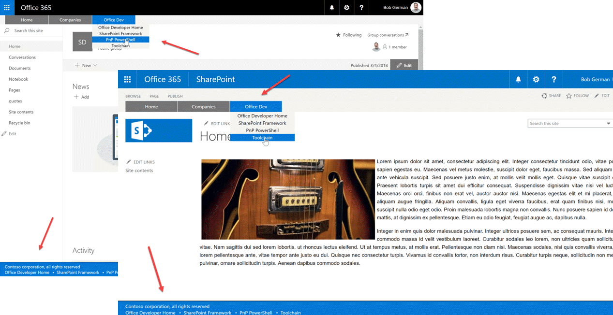
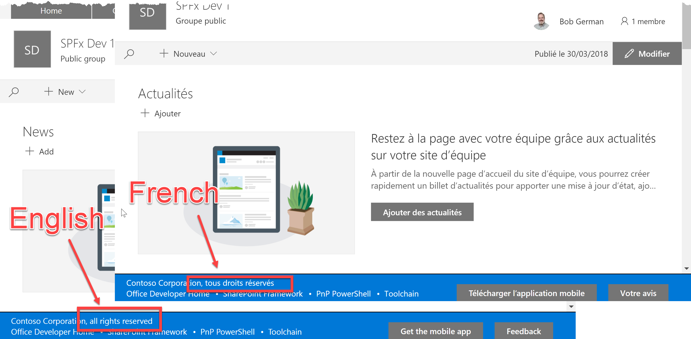

# Localized strings in solutions that span classic and modern sites
## (in the style of SharePoint Framework)

This article builds on an earlier one, [Building Headers and Footers that work on Classic and Modern sites](https://bob1german.com/2018/03/11/building-headers-and-footers-that-work-on-classic-and-modern-sites/). That article, with associated sample code, was about how to create a top menu and footer that work on both modern and classic SharePoint pages. On modern pages, the solution is a SharePoint Framework extension; on classic pages, it's a stand-alone solution that just happens to use SharePoint Framework tooling like TypeScript, WebPack, and React. That allows a very high degree of common code between the classic and modern implementations.


<br /><small style="font-style: italic">Figure 1</small>

The good news is that my POC was successful, and the partner and their customer liked it! 

> The sample code has moved! It's now in the [SharePoint Framework Extensions repo](https://github.com/SharePoint/sp-dev-fx-extensions/tree/master/samples/react-menu-footer-classic-modern).

I skipped over one key capability in my project, which was localization. The customer in this case is a large multi-national company, so it's not too surprising they would want to show some information in the user's preferred language.

So I set out to update the POC to add multi-lingual support. Now in a real implementation, you might want to add localized text for all the hyperlinks and menu choices, or perhaps even have a completely different menu and footer for each supported language. But that seemed too easy; instead I really wanted to show how to use the SPFx localization files in a non-SPFx solution. So I removed the footer message from my JSON data file and instead made it a localized string called `footerMessage`.


<br /><small style="font-style: italic">Figure 2</small>

SPFx stores localized text in a folder called `loc`. The first thing I did was move this folder into the `common` folder so the strings would be shared by both the classic and modern implementations. I also had to change the `localizedResources` property in `config.json` in my SharePoint Framework implementation, so it could find the folder.

Within `loc`, a file called myStrings.d.ts declares an interface for the strings, (with a property for each string to be localized), and a module that the SPFx code can consume. Here's the myStrings.d.ts file for my solution.

```JSON
declare interface ICustomHeaderFooterApplicationCustomizerStrings {
  FooterMessage: string;
}

declare module 'CustomHeaderFooterApplicationCustomizerStrings' {
  const strings: ICustomHeaderFooterApplicationCustomizerStrings;
  export = strings;
}

```

Then you need to provide a JavaScript file for each supported language, which contains a module with the strings for that language and is named after the [language tag](https://en.wikipedia.org/wiki/Language_localisation#Language_tags_and_codes), such as `en-us.js`. (Note this is _not_ a TypeScript file!) 

Here is the English language file in my project; I also included a French version.

```JavaScript
define([], function() {
  return {
    "FooterMessage": "Contoso Corporation, all rights reserved"
  }
});
```

Now the SharePoint Framework is smart enough to generate a separate bundle for each language, and it dynamically loads only the language needed. I wasn't feeling so ambitious, and was content to put all the translations into the main bundle. So my approach was to make a shim called `languageManager.ts` that wraps around the SPFx language management, and introduces simple language management for the Classic bundle. Code that wants to use localized strings will get them from the language manager rather than directly from SPFx. (You can see this in the component `Footer.tsx`.)

The SPFx version of `languageManager.ts` just reads the strings the usual way and provides them to its caller.

```TypeScript
import * as strings from 'CustomHeaderFooterApplicationCustomizerStrings';

export class languageManager {

    public static GetStrings(): ICustomHeaderFooterApplicationCustomizerStrings {
        return strings;
    }

}
```

The classic version checks the current language and then loads the corresponding module. Since this code will run on classic pages, it can use the old _spPageContextInfo.currentUICultureName variable that classic SharePoint sets up on every page. This will keep the language in sync with the SharePoint UI.

Here's the classic language manager:

```TypeScript
export class languageManager {

    public static GetStrings(): ICustomHeaderFooterApplicationCustomizerStrings {

        var localizedStrings: ICustomHeaderFooterApplicationCustomizerStrings = null;

        const pageContext: any = (<any>window)._spPageContextInfo;

        if (pageContext) {
            const uiCulture: string = pageContext.currentUICultureName;
            if (uiCulture) {
                switch (uiCulture.toLowerCase()) {
                    case 'en-us': {
                        localizedStrings = require('./common/loc/en-us');
                        break;
                    }
                    case 'fr-fr': {
                        localizedStrings = require('./common/loc/fr-fr');
                        break;
                    }
                }
            }

        }
        
        if (localizedStrings === null) {
            localizedStrings = require('./common/loc/en-us');
        }

        return localizedStrings;    
    }

}
```

When common code wants to access the localized strings, it just accesses the language manager.

```TypeScript
import { languageManager } from '../../languageManager';

...

const strings = languageManager.GetStrings();

doSomethingWith(strings.FooterMessage);
```

Now people around the world can enjoy headers and footers that span classic and modern sites!