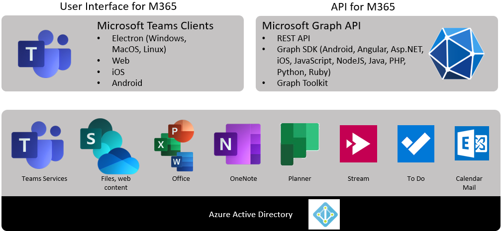
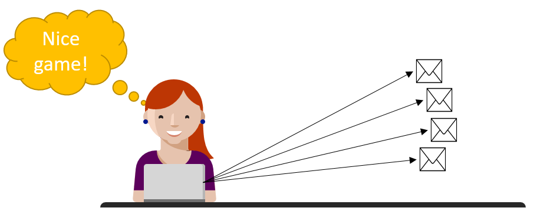
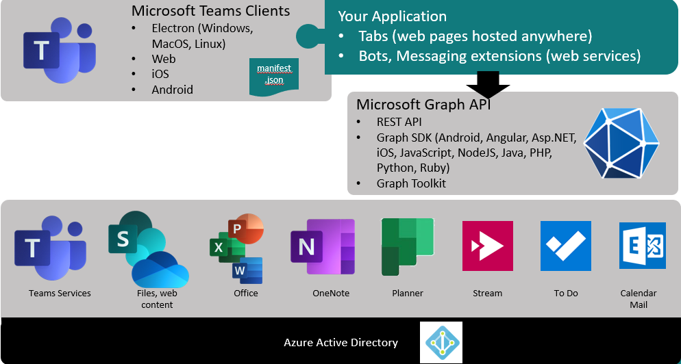

# Calling the Microsoft Graph from your Teams application - Part 1: Introduction

Microsoft Teams applications almost always need to call the Graph API, yet it's not as easy as just calling a REST service. Most of the complexity has to do with getting an access token, which is required on every Graph call to establish what, if anything, the caller is authorized to do. 

Getting the access token requires an understanding of Teams, Azure AD, Graph, and sometimes other components like the SharePoint Framework or Bot Framework, yet each of these is documented separately and each one assumes the reader knows all the others. I literally get questions every day from frustrated developers trying to figure this out! (Yesterday I got 3!)

These articles are companions for my talk, "Calling Microsoft Graph from your Teams Application", and will provide more detail and pointers to samples and other references.

1. Introduction (this article)
2. [Deep dive concepts](article2.md) - Deep dive concepts (optional)
3. [Calling Graph from a Teams tab](article3.md)
4. [Calling Graph from a Teams bot or messaging extension](article4.md)

This article will explain the basics. If all goes well, you can follow the step-by-step instructions in one of the sample apps and all will be well. Some day, the tooling may be improved to automate some of the steps. But you still need to understand the basics. The "deep dive" article is for those who are curious or who need to understand more detail to handle a specific situation or to aid in troubleshooting.

## Why the Graph API?

Just as Microsoft Teams is a unified user interface for many services all across Microsoft 365, the Microsoft Graph is a unified API across these services.

There are a number of advantages to going through the Graph as opposed to calling these services directly:

 * Applications only need to deal with a  single service endpoint for many services, allowing for improved scalability of both clients and services. Given _c_ clients and _s_ services, going through a concentrator like Graph means you have only _c+s_ services in the system vs. _c*s_ if each client called each service directly.
 
 * Overhead such as DNS lookups and authorization flows are shared across many services, allowing apps to perform better.

 * Graph can cache and relate information between services.

 * Graph is a lot more consistent than the individual service APIs, making it easier for developers to learn and reuse code. For example, sorting a list of email and a list of files both use the same OData syntax; this was not true of the native Exchange and SharePoint APIs.

Newer services, such as Microsoft Teams, don't provide native API's, they only use the Graph. So, for example, if your app needs details about the Team it's running in, it needs to call the Graph. Or if it needs details about the user, again that's the Graph. Any application that needs this kind of information needs to call the Graph.

> If you're new to the Microsoft Graph, a great place to start is the [Graph Explorer](https://developer.microsoft.com/en-us/graph/graph-explorer). It allows you to play with queries across all the services, and has many samples to get you started. If you log into the Graph you can see your own content; if not, you'll see sample content.

## The user is already logged into Teams, why can't my app just call the Graph?

I get this question a lot. The consise answer is, "because your app is not Teams."

To explain this further, consider the way traditional, old-school operating systems work.

 * An application is just a file in the file system; users can just run any application they want.
 * Applications have the permission of the users who run it. For example, if I can read my contacts list, and I run an application, the application can read my contacts list.

Many people are familiar with this approach and assume that's how the world works. It might have been OK 30-40 years ago when these operating systems were designed (e.g. Unix, which is the basis for MacOS and Linux, or DEC VMS, which heavily influenced Windows NT and its successors), but the problem with this approach is that the user has no way of knowing what an application is going to do when they run it.

For example, a user might want to play a game, but the game has a hidden "feature" of reading the user's contact list and sending them all spam email.

**To prevent this, modern operating systems apply permissions to applications as well as people.** This is true of most mobile operating systems like iOS and Android, and it's also the case for  cloud-based applications secured by Azure AD. Here are the new rules:

 * Apps need to be *registered* (just like users)
 * Apps need *permission* to access *resources* (just like users)
 * A user or administrator must *consent* to these permissions on an app by app basis

 For example, here's a game running on an Android tablet. It wants to read my contacts! I wonder why?

 

When I installed the game, it was registered with the OS. In order to read my contacts, it needs my permission. Maybe it's a bug, but I can't think of a good reason why this single-player game should have access to my contacts!  I declined. So the OS has saved me from perhaps giving away a bunch of private information in the course of playing a game on my tablet.

Now consider the architecture of a Teams application.

The application appears in the Microsoft Teams UI but it's still a separate application which runs outside of Teams. So this is why, in order to read your contacts (or access any of the many services available in the Graph API), you need to:

 * Register your application with Azure AD (which the Graph and all its underlying services use for authorization)
 * Specify the permissions (scopes) your app needs for specifc resources (such as [Contacts.Read](https://docs.microsoft.com/en-us/graph/permissions-reference#contacts-permissions))
 * Request an _access token_ from Azure AD which lets the Graph know what you're allowed to do

Azure AD will authenticate the user and, the first time your app asks for a permission, it will ask the user to consent. If it's a really big permission, such as Group.ReadWrite.All (allows reading and writing everything in M365 groups), then an administrator needs to consent as well.

> The Graph Explorer is an app from Microsoft that's registered in Azure AD. If you log in (to see your own data and not the sample), you can click the "modify permissions" button to select the permissions it will get. Graph Explorer will request an access token with those permissions, just like any app, and you may be prompted to log in or consent. Some permissions require an administrator to consent; if you're not an administrator in the tenant, you won't be able to grant those permissions although a tenant administrator could grant them.
 
## How do user and app permissions work together?

When your application wants to access resources owned by another application (such as Microsoft Graph), there are two kinds of permissions that come into play:

  * **User delegated** permissions allow an application to act _on behalf of a user_. Therefore, the effective permission is the intersection of the user's permission and the application's permission. For example, suppose Alice has access to files A, B, and C, and the application has Files.Read permission. When Alice runs the application, it can read files A, B, and C.

  * **Application** permissions allow an application to act _on its own behalf_. Therefore the effective permission is generally the application's permission across the whole tenant. This is often used for daemon services or to elevate permission beyond what the user can do. For example, if an application has Files.Read permission, it can read every file in the entire Microsoft 365 tenant.

Normally, your application will use Delegated permissions. (App permissions always require administrator consent and admins rightly think twice before approving such broad permissions unless they have thoroughly reviewed the application code.) App permissions are to be used sparingly, only when a user is not present or if the app needs to do something the user normally isn't permitted to do.

NOTE: A third option is emerging, which is called [_Resource-specific consent_](https://docs.microsoft.com/en-us/microsoftteams/platform/graph-api/rsc/resource-specific-consent) (RSC). This will allow a Team owner to grant app permissions to a single Microsoft Team instead of the whole tenant. It's still in Beta, however, and it only applies to Microsoft Teams itself and none of the other services that appear in Teams such as files (SharePoint and OneDrive) or calendars (Exchange). Due to those limitations, and the fact that this is already a pretty complex topic, RSC will not be considered in this article series.

> Graph Explorer runs in a web browser which is a so-called [public client](https://docs.microsoft.com/en-us/azure/active-directory/develop/msal-client-applications) because you can't realistically store secrets there. In order to get Application Permissions, an app needs to prove its indentity using an app secret or certificate; this just can't be secured in a web browser. For that reason, Graph Explorer and all web based appliations can only have User Delegated permissions. If you wanted app permission - to elevate beyond what the user can do, for example - you'd have to write a web service to do it for you; the web service is presumably on a secure server and thus is allowed to handle the app secret.

## OK so what's the big deal?

To get an access token requires knowing for sure who the user is - thus, the user has to prove their identity (log in). In Azure AD this is usually done via some kind of web browser - either a pop-up or hosted browser. This prevents applications from ever touching the user's password or other secrets, and allows Azure AD to enforce policies like multi-factor authentication and conditional access. It also allows Azure AD to prompt the user for any missing consents.

The challenge here is in providing Azure AD a safe browser in which to prompt the user.

 * Teams tabs and task modules are _IFrames_, and IFrames are not considered safe by Azure AD, so you can't get an access token from an IFrame without some assistance
 * Teams bots and messaging extensions don't provide a browser UI at all

For that reason, Teams provides a number of different options to let Azure AD interact with the user when required in the authorization process.

All this means that it's not enough for a Teams developer to understand the Graph and Azure AD; he or she also needs to understand the ways that Teams manages the situation so Azure AD has a browser window from which to prompt the user.

That's the reason for this blog series!

* If you want to learn the concepts more deeply, [proceed to Part 2 in the series](article2.md)
* If you're building a tab for Teams and want to start right away, [proceed to Part 3 in the series](article3.md)
* If you're building a bot or messaging extension for Teams and want to start right away, [proceed to Part 4 in the series](article4.md)

