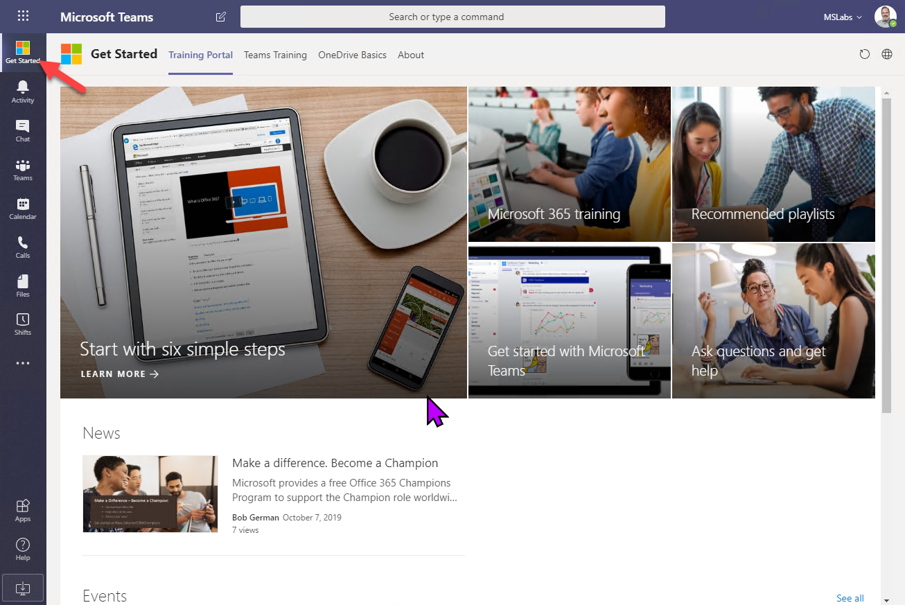
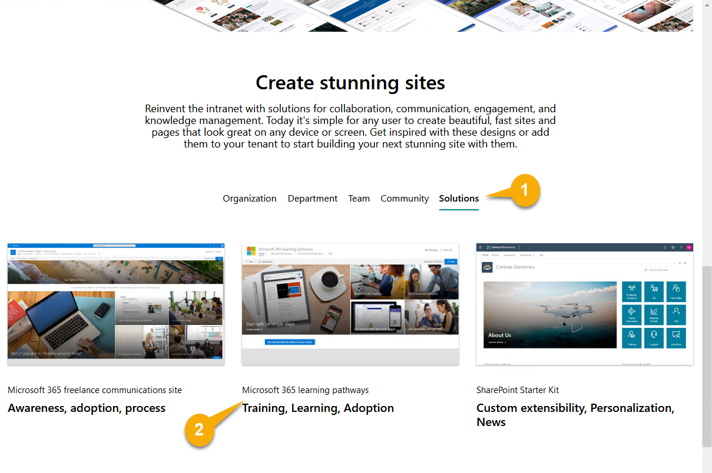
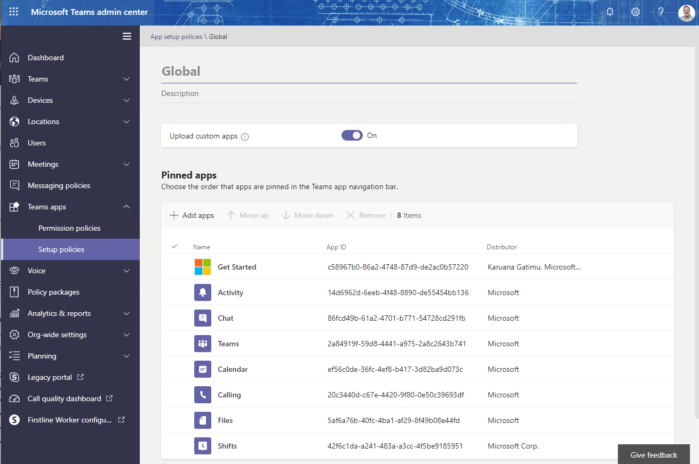

# Extending Microsoft Teams with SharePoint Pages

## Any SharePoint page can be a Teams Application

At the recent Teams Airlift in Bellevue, WA (and a number of other events), [Karuana Gatimu](https://github.com/karuanag) demonstrated a Get Started application that highlights [Microsoft 365 Learning Pathways](https://docs.microsoft.com/en-us/office365/customlearning/) in the Teams user interface. Users who are getting started and need a little instruction can click on the app and gain access to a rich training portal. If you're not familiar, Learning Pathways is a customizable training site you can host directly in SharePoint Online. Microsoft provides a large base of training content which is automatically updated as the M365 service changes, and the in-tenant SharePoint site stores the portal pages along with any enterprise-specific  help, support, and community content. Given the price (free) it's hard to imagine why any organization wouldn't deploy this!

But this isn't an article about Learning Pathways. The power in Karuana's demo went beyond that, as she showed how to share the Learning Pathways site from Microsoft Teams, available from the top of the Teams sidebar. (The Microsoft logo could be replaced with any icon you wish.) This encourages everyone to discover and access the training any time they're in Teams.

_Learning Pathways training portal is right at the top of the Teams sidebar_

It turns out this technique can be used for any SharePoint page. If you can edit a site page or format a list column, you can make a Teams application that users can access from the sidebar, as a personal application, or even as a tab within Teams channels. Anything you can do in (modern) SharePoint is up for grabs - Power Apps too - sky's the limit.

## Getting started with the Get Started app

The Get Started app is not only very useful, it's a good introduction to the general technique of building tabs out of SharePoint pages. (Actually, any web page will work as long as its security scheme works in Teams... and SharePoint sites work great.)

You really should do this first in a developer or test teant and not in production. If you don't have a developer tenant, you can get a free one [here](https://docs.microsoft.com/en-us/office/developer-program/office-365-developer-program).

Here are the high-level steps to set it all up in your tenant. Be sure you're a full tenant administrator; you'll need a lot of permission to set up Learning Pathways!

### 1. Install Learning Pathways

The first step is to install the training portal itself. (If you're just experimenting, you could use any SharePoint site). 

Learning Pathways is deployed using the [SharePoint PnP Provisioning Service](https://provisioning.sharepointpnp.com/), which will reach into your tenant and set everything up. Navigate to the [Provisioning Service](https://provisioning.sharepointpnp.com/) and scroll down a bit, then click the Solutions tab (1). From there, select the Microsoft 365 learning pathways solution (2).

[Installation instructions are here](https://docs.microsoft.com/en-us/office365/customlearning/custom_provision).

### 2. Get the Get Started app

The app is [in this repository](https://github.com/msft-teams/tools); either clone it or download a copy as a Zip file and extract the files. The app is in a folder called getStartedApp.

[Installation instructions are here](https://github.com/msft-teams/tools/blob/master/getstartedapp/installandconfig.md). At this point, you'll modify the manifest.json file with the URL's of your Learning Pathways site, and mark your SharePoint domain as valid so Teams will allow it. 

You can also [replace the icons](https://docs.microsoft.com/en-us/microsoftteams/platform/concepts/build-and-test/apps-package#icons) if you wish, and change the app name, etc. If you want all the details, check out the [manifest schema](https://docs.microsoft.com/en-us/microsoftteams/platform/resources/schema/manifest-schema).

### 3. Deploy the app

The easiest way to deploy your app is right inside the Teams UI, by selecting the apps sidebar icon (1). To view the enterprise app store, click the link marked "Built for (your tenant name)" (2).  You can see I only have the Get Started (Learning Pathways) app in my catalog (3). 

You can upload an app using the Upload link (4).

 * If you are a tenant admin, you can upload into your tenant's enterprise app catalog
 * If Teams app policy allows you to upload apps, you can upload an app for your own use or install it directly into a Team. This is disabled by default and must be turned on in an [app setup policy in the Teams admin portal](https://docs.microsoft.com/en-us/microsoftteams/teams-app-setup-policies).

For the Get Started app, you want to upload into the enterprise app catalog so everybody can use the app.

### 4. Pin the app

Apps are pinned in the same place as uploads are enabled: in an [app setup policy](https://docs.microsoft.com/en-us/microsoftteams/teams-app-setup-policies). You can set up different policies that pin different apps, and assign them to various users. A common use of this is to show the [Shifts app](https://docs.microsoft.com/en-us/microsoftteams/expand-teams-across-your-org/shifts/manage-the-shifts-app-for-your-organization-in-teams) only to the first line workers who need it.

The app may take up to 24 hours to appear in Teams - or to update, so again it's worth working out any kinks in a test tenant first.

# Beyond Get Started

NOTE: You could make any number of these apps! Just be sure name them differently and to replace the app ID with a [unique ID](https://www.guidgenerator.com/) each time. 

## How does this all work?

To understand how this works, you'll need to understand a little about Microsoft Teams applications. Teams applications can include custom tabs, bots, UI extensions ("messaging extensions"), and more. The Learning Pathways sample is a small Teams app containing some static tabs that display the Learning Pathways SharePoint pages; this is installed in the tenant's enterprise app catalog and pinned to the sidebar for all users.

Teams apps don't actually run in Teams, they just look like they do. Teams cleverly stitches apps into its UI, either by exchanging web service calls or, in the case of tabs, displaying web pages. A tab is just a web page displayed in an IFrame or embedded web browser. [The "website" tab in Teams](http://davidgiard.com/2019/01/27/AddingAWebsiteTabToAMicrosoftTeamsChannel.aspx) is an obvious example.

To have a Teams app, you need a Teams app package, which is a just zip file containing 3 files: two icons (one color and one semi-transparent) and a file called manifest.json. The manifest.json file tells Teams where the various parts of the app are located; in this case, it contains the URL's of the Learning Pathways site pages. [(View it here)](https://github.com/msft-teams/tools/blob/master/getstartedapp/manifest.json). You can create the app package manually, or use another Teams app called [App Studio](https://docs.microsoft.com/en-us/microsoftteams/platform/concepts/build-and-test/app-studio-overview) to do it. This article includes some features not yet in App Studio, so we'll be creating the manifest file manually; if you can edit a little JSON and zip it up, you have the necessary skills.

You can control who can use the app, and pin it to the sidebar, using [Teams app policies](https://docs.microsoft.com/en-us/microsoftteams/teams-custom-app-policies-and-settings) in the Teams admin portal.

.

As you can see I've pinned the Get Started app to the top of the sidebar using this screen.

References

* [Create an app package for your Microsoft Teams app](https://docs.microsoft.com/en-us/microsoftteams/platform/concepts/build-and-test/apps-package)
* [Use built-in and custom tabs in Microsoft Teams](https://docs.microsoft.com/en-us/microsoftteams/built-in-custom-tabs)