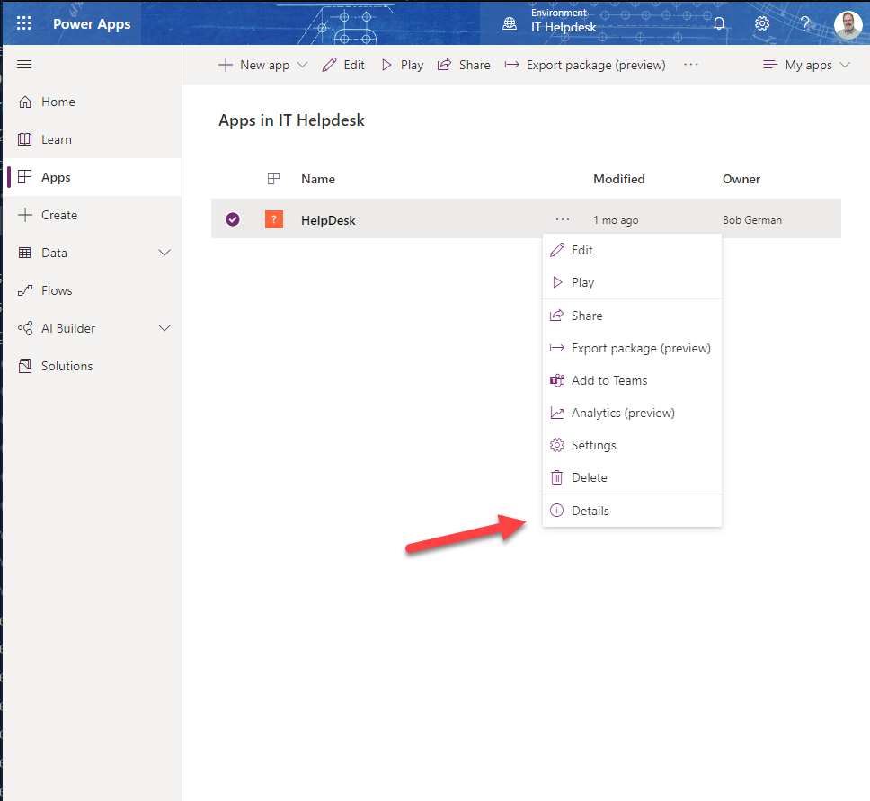
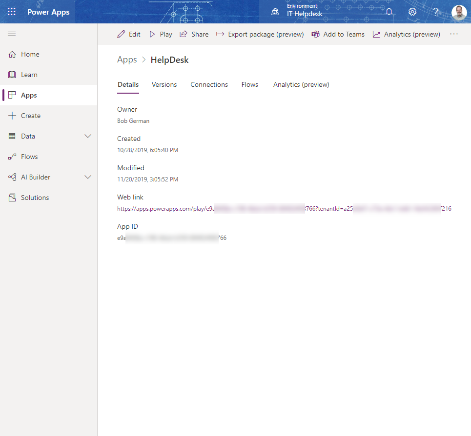

# Extending Microsoft Teams with SharePoint Pages

## Part 1 - Get Started

This is Part 1 of a 2-part series which will show you how to make Teams applications using modern SharePoint pages. It's not about the SharePoint Framework, which is a great option, but one that requires coding. This is the easy approach; if you can edit a SharePoint page, format a list, or make a Power App, you can make a Teams app.

Of course there are built-in tabs to allow these things, but there are a number of advantages to building a proper Teams app:

 - You can distribute and manage it centrally in the [Tenant App Catalog](https://docs.microsoft.com/en-us/microsoftteams/tenant-apps-catalog-teams)
 - Users can install it by name - no need to configure a website or Power Apps tab
 - You can use app policies to set permission and target the app to the users who need it, and optionally pin it to the Teams sidebar

**PART 1 (this article)** - Introduces the Get Started app and explains Teams Tab principles

**PART 2** - Shows how to use Teams App Studio and a new Tab Configuration web part to build your own static and configurable tabs

## Any SharePoint page can be a Teams Application

At events around the world lately, [Karuana Gatimu](https://github.com/karuanag) has demonstrated a Get Started application that displays the [Microsoft 365 Learning Pathways](https://docs.microsoft.com/en-us/office365/customlearning/) portal right in Microsoft Teams. Users who are new to M365 and need a little instruction can click on the app and gain access to a rich training portal. 

_The Learning Pathways training portal is right at the top of the Teams sidebar_

If you're not familiar, Learning Pathways is a customizable training portal you can host directly in SharePoint Online. Microsoft provides a large base of training content which is automatically updated as the M365 service changes, and the in-tenant SharePoint site stores the portal pages along with any enterprise-specific  help, support, playlists, etc. Given the price (free), it's hard to imagine why any organization wouldn't deploy this!

But this isn't an article about Learning Pathways. The power in Karuana's demo went beyond that, as she showed how to share a SharePoint site from within Microsoft Teams, and pin it to the Teams sidebar. The Intranet, or parts of it anyway, can surface right in Teams: SharePoint content, news, search, and also Power Apps and other web based solutions are all at the ready.

This article will explain the Get Started app, and in the process, the concepts behind making a SharePoint site into a Teams app. Please give a try, both to evaluate the solution and as a learning experience on how to build Teams apps with SharePoint.

## Getting started with the Get Started app

It's a really good idea to begin in a developer or test teant and not in production. If you don't have a developer tenant, you can get a free one [here](https://docs.microsoft.com/en-us/office/developer-program/office-365-developer-program).

Here are the high-level steps to set it all up in your tenant, along with links to the details of each. Be sure you're a full tenant administrator; you'll need a lot of permission to set up Learning Pathways!

### 1. Install Learning Pathways

The first step is to install the training portal itself. Learning Pathways is deployed using the [SharePoint PnP Provisioning Service](https://provisioning.sharepointpnp.com/), which will reach into your tenant and set everything up. Navigate to the [Provisioning Service](https://provisioning.sharepointpnp.com/) and scroll down a bit, then click the Solutions tab (1). From there, select the Microsoft 365 learning pathways solution (2).
The [installation instructions are here](https://docs.microsoft.com/en-us/office365/customlearning/custom_provision).

### 2. Get the Get Started app

The app is [in this Github repository](https://github.com/msft-teams/tools); either clone it or download a copy as a Zip file and extract the files. The app is in a folder called getStartedApp.

The [installation instructions are here](https://github.com/msft-teams/tools/blob/master/getstartedapp/installandconfig.md). During the setup, you'll modify the manifest.json file with the URLs you want to show from your Learning Pathways site or elsewhere, and you'll mark your SharePoint domain as valid so Teams will allow it. Then you'll create a Teams app package, which is just a Zip archive containing the manifest file and icons.

    NOTE: Karuana's instructions begin by asking you to decide what pages you want to expose in Get Started. That's good guidance so your solution meets users' needs! She suggests limiting yourself to 5 tabs for usability.

You can also [replace the icons](https://docs.microsoft.com/en-us/microsoftteams/platform/concepts/build-and-test/apps-package#icons) if you wish, and change the app name, etc. If you want all the details, check out the [manifest schema](https://docs.microsoft.com/en-us/microsoftteams/platform/resources/schema/manifest-schema).

### 3. Deploy the app to your Tenant App Catalog

The easiest way to deploy your app is right inside the Teams UI, by selecting the apps sidebar icon (1). To view the enterprise app store, click the link marked "Built for (your tenant name)" (2).  You can see I only have the Get Started (Learning Pathways) app in my catalog (3). 

You can upload an app using the Upload link (4).

 * If you are a tenant admin, you can upload into your tenant's enterprise app catalog using the "Upload to (tenant name)" link.
 * If Teams app policy allows you to upload apps, you can upload an app for your own use or install it directly into a Team. This is disabled by default and must be turned on in an [app setup policy in the Teams admin portal](https://docs.microsoft.com/en-us/microsoftteams/teams-app-setup-policies).

For the Get Started app, you want to upload into the enterprise app catalog so everybody can use the app.

### 4. Pin the app

Apps are pinned in the same place as uploads are enabled: in an [app setup policy](https://docs.microsoft.com/en-us/microsoftteams/teams-app-setup-policies) in the Teams administration portal. You can set up different policies that pin different apps, and assign them to various users. A common use of this is to show the [Shifts app](https://docs.microsoft.com/en-us/microsoftteams/expand-teams-across-your-org/shifts/manage-the-shifts-app-for-your-organization-in-teams) to the first line workers who need it.

_Apps pinned in an app settings policy_

The app may take up to 24 hours to appear in Teams (or to update, so again it's worth working out any kinks in a test tenant first!)

    NOTE: You could make any number of these apps with different names, icons, and pages! Just be sure name them differently and to replace the app ID with a [unique ID](https://www.guidgenerator.com/) each time. 

## More ideas for Pages that become Apps

 * A list with formatting and CRUD operations (remember when they called lists "apps"?)
 * A small dashboard of web parts showing charts and information feeds
 * Recent news affecting the team
 * Frequently used information such as reference material, help pages, policies, and checklists
 * A Power App (see below for how to get the URL)
 * Check out the other sites available in the [SharePoint PnP Provisioning Service](https://provisioning.sharepointpnp.com/) for more ideas
 
    NOTE: SharePoint hides most of its own navigation when viewing in Teams, so keep your apps simple or users may reach a dead end. A single page per tab is most ideal!

To obtain the URL for a Power App, go to the list of Apps in [Power Apps](https://make.powerapps.com/) and select Details from the context menu for your app.

Copy the Web URL and use it in your tab.

## How does this all work?

Teams is a brilliant facade over most of Microsoft 365, including SharePoint. Whether you're using the Teams Electron app in Windows or MacOS, viewing Teams in a browser, or using one of the mobile apps, Teams brings myriad back-end services into a single, unfied view for users.

Like the other services, Teams apps don't actually run in Teams, they just look like they do. Teams apps can  include tabs, bots, UI extensions ("messaging extensions"), Office 365 connectors, and more. Teams cleverly stitches it all together based on information in the app manifest.

The Get Started app consists of static tabs, declared in the manifest like this:

~~~ JSON
"staticTabs": [
  {
    "entityId": "201911011330",
    "name": "Training Portal",
    "contentUrl": "https://vnextday.sharepoint.com/sites/M365LPV3",
    "websiteUrl": "https://vnextday.sharepoint.com/sites/M365LPV3",
    "scopes": [
        "personal"
    ]
  },
  ...
~~~

* The entity ID identifies the tab even if the name changes; it has to be unique
* The name is what the user sees
* The content URL is the URL to display in the Teams app; the website URL is the URL to display if the app needs to pop out a separate web browser
* The scope specifies if the tab should work in personal, group chat, and/or teams scope. Static tabs only work in personal scope.

Static tabs are personal - that is, they are displayed directly to one user at a time, rather than in a shared environment like a Teams channel or group chat. 

## What's next?

In Part 2 of the series, you'll learn how to create apps without editing JSON using a tool called App Studio, and how to make configurable tabs that work in group chat and Teams channels.

