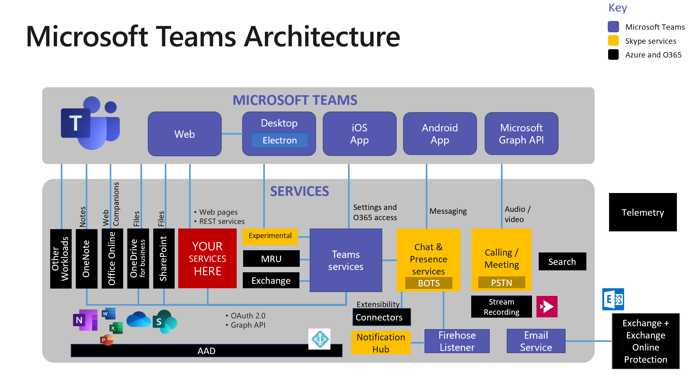

# Extending Microsoft Teams with SharePoint Pages

## Part 1 - Get Started

This is Part 1 of a 3-part series which will show you how to make Teams applications using modern SharePoint pages and potentially no code at all. This goes beyond the ability to place a SharePoint page in a Team; the resulting Teams apps can be published in the [Tenant Apps Catalog](https://docs.microsoft.com/en-us/microsoftteams/tenant-apps-catalog-teams), targeted and pinned using App policies, and easily installed by users by name, with no special setup instructions or URLs to copy.

* Part 1 - Get Started (this article) - Explains the concepts and how to set up Karuana Gatimu's Get Started application to publish the Microsoft 365 Learning Pathways site in Teams
* Part 2 - Building Personal Apps with Static Tabs - Explains how to build on the Get Started idea to publish other modern SharePoint pages and Power Apps as personal apps
* Part 3 - Building Teams and Group Chat Apps with Configurable Tabs - Explains how to build configurable apps using SharePoint pages and Power Apps in Teams channels and group chats

## Any SharePoint page can be a Teams Application

At the recent Teams Airlift in Bellevue, WA (and a number of other events), [Karuana Gatimu](https://github.com/karuanag) demonstrated a Get Started application that displays the [Microsoft 365 Learning Pathways](https://docs.microsoft.com/en-us/office365/customlearning/) portal in the Teams user interface. Users who are new to M365 and need a little instruction can click on the app and gain access to a rich training portal. 

If you're not familiar, Learning Pathways is a customizable training site you can host directly in SharePoint Online. Microsoft provides a large base of training content which is automatically updated as the M365 service changes, and the in-tenant SharePoint site stores the portal pages along with any enterprise-specific  help, support, and community content. Given the price (free), it's hard to imagine why any organization wouldn't deploy this!

_The Learning Pathways training portal is right at the top of the Teams sidebar_

But this isn't an article about Learning Pathways. The power in Karuana's demo went beyond that, as she showed how to share the Learning Pathways site from Microsoft Teams, available from the top of the Teams sidebar. (The Microsoft logo could be replaced with any icon you wish.) This encourages everyone to discover and access the training any time they're in Teams.

This article will explain the Get Started app; the articles that follow will help you build on the idea and create other apps based on SharePoint pages and Power Apps. Actually, any web page will work as long as it can run in a browser IFrame.

## Getting started with the Get Started app

It's a really good idea to begin in a developer or test teant and not in production. If you don't have a developer tenant, you can get a free one [here](https://docs.microsoft.com/en-us/office/developer-program/office-365-developer-program).

Here are the high-level steps to set it all up in your tenant, along with links to the details of each. Be sure you're a full tenant administrator; you'll need a lot of permission to set up Learning Pathways!

### 1. Install Learning Pathways

The first step is to install the training portal itself. (If you're just experimenting, you could use any SharePoint site). Learning Pathways is deployed using the [SharePoint PnP Provisioning Service](https://provisioning.sharepointpnp.com/), which will reach into your tenant and set everything up. Navigate to the [Provisioning Service](https://provisioning.sharepointpnp.com/) and scroll down a bit, then click the Solutions tab (1). From there, select the Microsoft 365 learning pathways solution (2).

[Installation instructions are here](https://docs.microsoft.com/en-us/office365/customlearning/custom_provision).

### 2. Get the Get Started app

The app is [in this repository](https://github.com/msft-teams/tools); either clone it or download a copy as a Zip file and extract the files. The app is in a folder called getStartedApp.

[Installation instructions are here](https://github.com/msft-teams/tools/blob/master/getstartedapp/installandconfig.md). At this point, you'll modify the manifest.json file with the URL's of your Learning Pathways site, and mark your SharePoint domain as valid so Teams will allow it. Then you'll create a Teams app package, which is just a Zip archive containing the manifest file and icons.

    NOTE: Karuana's instructions begin by asking you to decide what pages you want to expose in Get Started. That's good guidance so your solution meets users' needs! She suggests limiting yourself to 5 tabs for usability.

You can also [replace the icons](https://docs.microsoft.com/en-us/microsoftteams/platform/concepts/build-and-test/apps-package#icons) if you wish, and change the app name, etc. If you want all the details, check out the [manifest schema](https://docs.microsoft.com/en-us/microsoftteams/platform/resources/schema/manifest-schema).

### 3. Deploy the app to your Tenant App Catalog

The easiest way to deploy your app is right inside the Teams UI, by selecting the apps sidebar icon (1). To view the enterprise app store, click the link marked "Built for (your tenant name)" (2).  You can see I only have the Get Started (Learning Pathways) app in my catalog (3). 

You can upload an app using the Upload link (4).

 * If you are a tenant admin, you can upload into your tenant's enterprise app catalog using the "Upload to (tenant name)" link.
 * If Teams app policy allows you to upload apps, you can upload an app for your own use or install it directly into a Team. This is disabled by default and must be turned on in an [app setup policy in the Teams admin portal](https://docs.microsoft.com/en-us/microsoftteams/teams-app-setup-policies).

For the Get Started app, you want to upload into the enterprise app catalog so everybody can use the app.

### 4. Pin the app

Apps are pinned in the same place as uploads are enabled: in an [app setup policy](https://docs.microsoft.com/en-us/microsoftteams/teams-app-setup-policies) in the Teams administration portal. You can set up different policies that pin different apps, and assign them to various users. A common use of this is to show the [Shifts app](https://docs.microsoft.com/en-us/microsoftteams/expand-teams-across-your-org/shifts/manage-the-shifts-app-for-your-organization-in-teams) only to the first line workers who need it.

_Apps pinned in an app settings policy_

The app may take up to 24 hours to appear in Teams - or to update, so again it's worth working out any kinks in a test tenant first.

    NOTE: You could make any number of these apps with different names, icons, and pages! Just be sure name them differently and to replace the app ID with a [unique ID](https://www.guidgenerator.com/) each time. 

## How does this all work?

To understand how this works, you'll need to understand a little about Microsoft Teams applications. 

Teams apps don't actually run in Teams, they just look like they do. Teams cleverly stitches apps into its UI, much as it does for Microsoft's own services. Whether you're using the Teams Electron app in Windows or MacOS, viewing it in a browser, or using one of the native mobile apps, Teams brings myriad back-end services into a single, unfied view for users.

A Teams tab is just a web page displayed in an IFrame or embedded web browser. [The "website" tab in Teams](http://davidgiard.com/2019/01/27/AddingAWebsiteTabToAMicrosoftTeamsChannel.aspx) is an obvious example. Teams applications can also include bots, UI extensions ("messaging extensions"), Office 365 connectors, and more. These things don't run in Teams either; instead they are hosted somewhere else on the Internet, and Teams communicates with them using web services.

The Get Started sample is a small Teams app containing some static tabs that display the Learning Pathways SharePoint pages. Static tabs are personal - that is, they are displayed directly to one user at a time, rather than in a shared environment like a Teams channel or group chat. 

Part 2 of the series shows you how to create your own static tabs applications using a tool called App Studio, and will give more ideas on how to use SharePoint pages and even PowerApps in static tabs. 

Part 3 of this series covers configurable tabs that can be used in shared environments. Instead of coding your own configuration page, the article shows how to use a new Tab Configuration web part to allow users to select which tab they want to set up, and even to centrally update page locations across the tenant.

References

* [Create an app package for your Microsoft Teams app](https://docs.microsoft.com/en-us/microsoftteams/platform/concepts/build-and-test/apps-package)
* [Use built-in and custom tabs in Microsoft Teams](https://docs.microsoft.com/en-us/microsoftteams/built-in-custom-tabs)