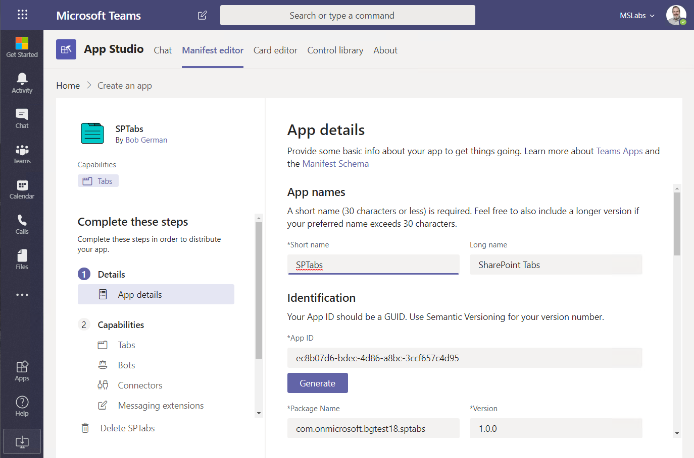

# Extending Microsoft Teams with SharePoint Pages

## Part 2 - Building your own app

This is Part 2 of a 2-part series which will show you how to make Teams applications using modern SharePoint pages. It's not about the SharePoint Framework, which is a great option, but one that requires coding. This is the easy approach; if you can edit a SharePoint page, format a list, or make a Power App, you can make a Teams app.

Of course there are built-in tabs to allow these things, but there are a number of advantages to building a proper Teams app:

 - You can distribute and manage it centrally in the [Tenant App Catalog](https://docs.microsoft.com/en-us/microsoftteams/tenant-apps-catalog-teams)
 - Users can install it by name - no need to configure a website or Power Apps tab
 - You can use app policies to set permission and target the app to the users who need it, and optionally pin it to the Teams sidebar

**PART 1** - Introduces the Get Started app and explains Teams Tab principles

**PART 2 (this article)** - Shows how to use Teams App Studio and a new Tab Configuration web part to build your own static and configurable tabs

## App Studio

Github was a good way to share the Get Started app, so anyone can get a copy and adapt it to their needs. But if you're starting a new app, especially a simple one based on SharePoint pages, you might like to skip the JSON and go to a tool called [App Studio](https://docs.microsoft.com/en-us/microsoftteams/platform/concepts/build-and-test/app-studio-overview).

App studio is itself a Teams app (how meta!) - and it includes a great manifest editor. You can install apps right from App Studio for testing, and then export the app package for installating into the tenant App Catalog.

Here [are the installation instructions](https://docs.microsoft.com/en-us/microsoftteams/platform/concepts/build-and-test/app-studio-overview).

Begin by selecting the Manifest Editor tab and create a new manifest. The editor will open, where you can enter the app details. 

Scroll through all the details and fill them in; details about each entry are in the [manifest schema](https://docs.microsoft.com/en-us/microsoftteams/platform/resources/schema/manifest-schema).

## Adding static tabs

To add a personal tab - like the Get Started app - click Tabs and add a personal tab.

Enter the name, unique entity ID, and URL to display in Teams or a separate browser, and click Save.

Then click on Domains and Permissions, and add your SharePoint domain (or Powerapps, etc.) to the list of valid domains. For example, if your SharePoint site is https://mytenant.sharepoint.com/stes/foo, enter only mytenant.sharepoint.com.

Finally, click Test and distribute to test your app. 
If you click Install and then Add, you can run the app in personal scope and see your tab(s) in action.

    NOTE: You must enable application uploading in an App Settings policy in Teams Administration to allow installing apps in this way

When you're ready, you can download the app and save it, or upload it into the tenant app catalog.

## Adding configurable Tabs

Static tabs are great but they only work in personal scope. What if you want to include a Teams channel tab or two in your application? Or perhaps you want to target group chat with your tabs?

To use Teams and Group Chat scope requires a configurable tab, in which the user configures the tab when it's added. The configuration screen is a web page that you must supply, and it needs to include some JavaScript code that configures and saves the tab. 

That might seem like the end of the line for low-code developers but wait - this is SharePoint so anything is possible! There's a sample SPFx web part that you can install to turn any SharePoint page into a Teams tab configuration page, and even redirect tabs later on in case you decide to change page URLs.

### Configure Tab Web Part

#### 1. Install the web part

The web part is part of the SharePoint Framework samples and is ([temporarily here](https://github.com/BobGerman/sp-dev-fx-webparts/tree/dev/samples/react-teams-configure-tab), [eventually here](https://github.com/SharePoint/sp-dev-fx-webparts/tree/master/samples/react-teams-configure-tab)). To build the web part you'll need to install the latest stable version of NodeJS, and to run a few commands. (Details are in the [SharePoint Framework Development setup](https://docs.microsoft.com/en-us/sharepoint/dev/spfx/set-up-your-development-environment) instructions.)

* Clone or download the web part code
* Install and build the package using these commands:

~~~sh
npm i
npm i -g gulp
gulp bundle --ship
gulp package-solution --ship
~~~

Now you need to upload the web part to your SharePoint app catalog ([instructions are here](https://docs.microsoft.com/en-us/sharepoint/dev/spfx/web-parts/get-started/serve-your-web-part-in-a-sharepoint-page#deploy-the-helloworld-package-to-app-catalog)). Continue to follow [the instructions](https://docs.microsoft.com/en-us/sharepoint/dev/spfx/web-parts/get-started/serve-your-web-part-in-a-sharepoint-page#install-the-client-side-solution-on-your-site) and install the client-side solution into the SharePoint site that will host your web part.

#### 2. Create the configuration page

Create a new modern SharePoint page that will become the tab configuration page, and add the Configure Tab web part. Edit the web part to set up the tab information.

Your configuration page will present users with one or more choices for tabs they'd like to show. Enter a line for each choice into the edior panel:

(1) Enter a name for each tab, each on its own line
(2) Enter a unique entity ID for each tab, each on its own line corresponding to the lines in (1)
(3) Enter the URL for each tab, again each on its own line

If you want all tab clicks to be redirected back through this page, select the Redirect checkbox. This allows you to change the URL's for tabs even after they've been configured, however users may notice the page flickering as they are redirected.

#### 3. Set up the app manifest

Now in App Studio, create a Team Tab. Paste the URL of your configuration page into the Configuration URL field.

If you want users to be able to edit the tab and return to the configuration page (and maybe switch to another choice), then check the Can update configuration checkbox. You can also decide if your app is available in Teams, Group Chats, or both.

#### 4. Deploy

Now check to be sure the valid domains are set up (as above) and install the app into a Teams channel or Group Chat. You will be presentd with the configuration page.

If you only configured one choice, just click the Save button and save your tab. If you configured multiple choices, pick one and the save button will light up and allow you to save the tab.

Now your page is visible within the new tab for all to see.

#### 5. Maintain

If you set the web part up to redirect tab clicks, it saved its own URL and the entity ID into Teams for each tab. The web part will look at the entity ID and redirect to the target page. Thus it is possible to edit the web part and change the URLs, and thus change all the tabs that had previously been created.

If you edit the web part and remove the choice (entity ID), it will prompt the user to edit the tab and make another selection.

## Conclusion

SharePoint is a world-class content editing tool, and a wonderful canvas for "composite" apps. So why not use it to create a quick Teams app or two?

References

* [Create an app package for your Microsoft Teams app](https://docs.microsoft.com/en-us/microsoftteams/platform/concepts/build-and-test/apps-package)
* [Use built-in and custom tabs in Microsoft Teams](https://docs.microsoft.com/en-us/microsoftteams/built-in-custom-tabs)