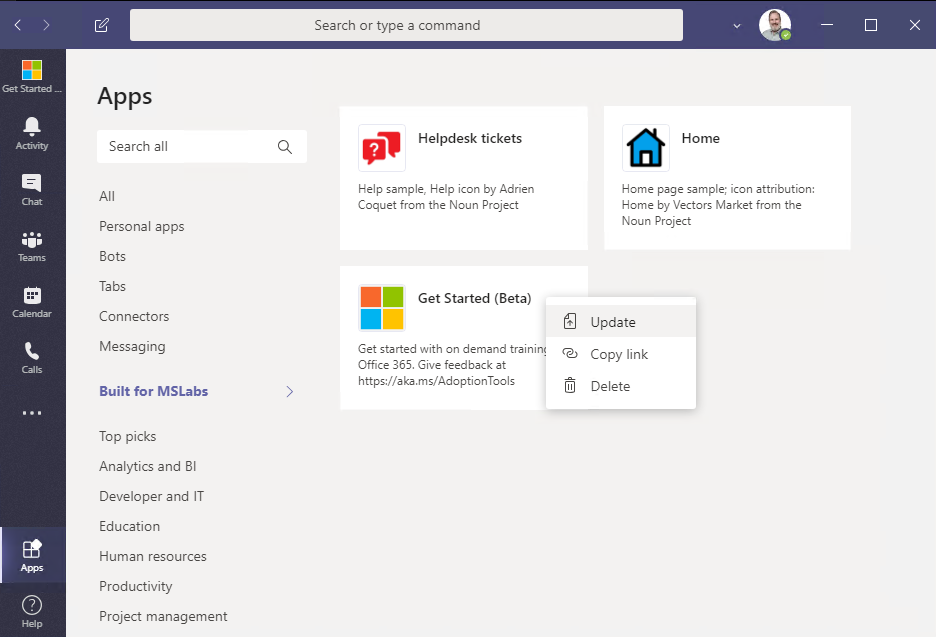

# Updates to Extending Microsoft Teams with SharePoint Pages

This is an addendum to the [2-part series](article1.md) which includes updates from Teams engineering that will make the SharePoint pages render much more reliably, especially in the desktop client.

The main articles have been updated, so if you're just starting you can skip this page.

If you built tabs using the original instructions, you'll need to make the following changes to your app manifest:

1. Increment the app version #
2. Transform all contentUrl properties to include the SharePoint SSO login page; leave the websiteUrl properties alone. For example,

~~~json
"contentUrl": "https://<YOUR TENANT>.sharepoint.com/_layouts/15/teamslogon.aspx?SPFX=true&dest=/sites/<LEARNING PATHWAYS SITE>",
"websiteUrl": "https://<YOUR TENANT>.sharepoint.com/sites/M365LPV3",
~~~

3. Ensure valid domains are in place and add webApplicationInfo

~~~json
"validDomains": [
    "*.login.microsoftonline.com",
    "*.sharepoint.com",
    "*.sharepoint-df.com",
    "spoppe-a.akamaihd.net",
    "spoprod-a.akamaihd.net",
    "resourceseng.blob.core.windows.net",
    "msft.spoppe.com"
  ],
  "webApplicationInfo": {
    "id": "00000003-0000-0ff1-ce00-000000000000",
    "resource": "https://<YOUR TENANT>.sharepoint.com"
  }
~~~

4. Update the zip file and update the app in the enterprise app catalog

