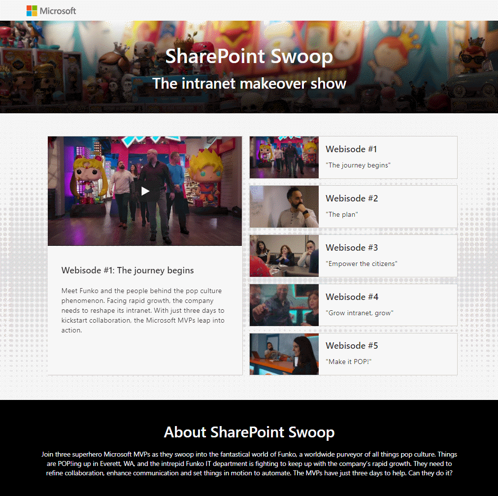

# Swooping into SharePoint Site Designs

Several months ago, out in Everett, Washington, a group of SharePoint MVP's gathered to remake an intranet for international toy company Funko, Inc. The result was, well, a new Intranet, and the [SharePoint Swoop](https://techcommunity.microsoft.com/t5/Microsoft-SharePoint-Blog/SharePoint-Swoop-the-intranet-makeover-show/ba-p/186892) reality TV show.

 This is a story from behind the scenes,in which I got to make their work reusable with SharePoint Site Designs and Scripts. I'll start with the story, then dig into the technical details.

## SharePoint Swoop

SharePoint Swoop is a new kind of reality TV show. Fashion and home makeover shows have become hackneyed! It's make over our digital experiences, and SharePoint Swoop does just that. And what could be a better subject than [Funko](https://www.funko.com/), maker of exclusive collectibles including Pop! Vinyl licensed figures?

SharePoint MVPs 
[Ben Nualin](https://twitter.com/bniaulin)
,
[Sue Hanley](https://twitter.com/susanhanley), and
[Laura Rogers](https://twitter.com/WonderLaura)
descended on Funko headquarters and set out to remake their Intranet in only three days.
You can watch the series [here](https://aka.ms/SharePointSwoop) (binge watching encouraged!)

## The need for reuse

With only three days, the team had to stay focused. Funko's product development team volunteered to have the team remake their site, but what about the other Funko departments? Wouldn't it be nice if you could push a button and make sites for the other departments based on the same design? A button, well, like this:

Funko is a modern company, so naturally they wanted their Intranet to be built on Microsoft's modern Communication sites. They wanted their department sites to include a Hero web part at the top of the home page, initially without images loaded; below that they wanted News of the left and Frequently Needed Links on the right.  They also wanted to set up an About page, and a custom view of the Pages library to facilitate page management. The resulting site looks like this (before adding content):

When a user pushes the button, the Site Design runs and creates the site with the desired structure. Although the feature hadn't even made preview status, with the help of [Sean Squires](https://twitter.com/iamseansquires) and [Vesa Juvonen](https://twitter.com/vesajuvonen), it was working before long.

## Why Site Designs and Scripts?

Site Designs have several advantages over previous site provisioning techniques, including:

* They run server side, so they're faster than calling a client API's for each step of site creation
* They're repeatable; run them again and again. When a site design is updated, just rerun it to bring the site up to the latest and greatest
* They're governed by permissions; IT can control who can create sites from each design
* A Site Design is made of Site Scripts; this allows reuse of parts of a site structure among multiple site designs. For example, if several types of sites need a certain list and views, that can be put in a separate site script and reused across all the designs

Site scripts are JSON files that contain use _actions_, which can set up almost anything you'd want in a new site:

#### Site Settings
* addPrincipalToSPGroup
* addNavLink
* applyTheme
* setSiteLogo
* setRegionalSettings
* setSiteExternalSharingCapability
* triggerFlow
* joinHubSite

#### SharePoint Components
* createSPList
* addSPField
* deleteSPField
* addSPFieldXml
* createSiteColumn
* createSiteColumnXml
* addSiteColumn
* addContentType
* createContentType
* removeContentType
* addSPView
* removeSPView
* setSPFieldCustomFormatter

#### SharePoint Framework Solutions
* installSolution
* associateExtension
* associateListViewCommandSet
* associateFieldCustomizer 

This demo shows how to:

* Trigger a Microsoft Flow to call an Azure function to do things that aren't (yet?) supported by Site Designs; in this case, that includes placement of sections and web parts onto the home page, creation of an About page, and a customized view on the Site Pages library
* Create and include a Theme
* Deploy site designs and scripts using PowerShell to inject environment-specific values such as the tenant name, logo URL, etc.

