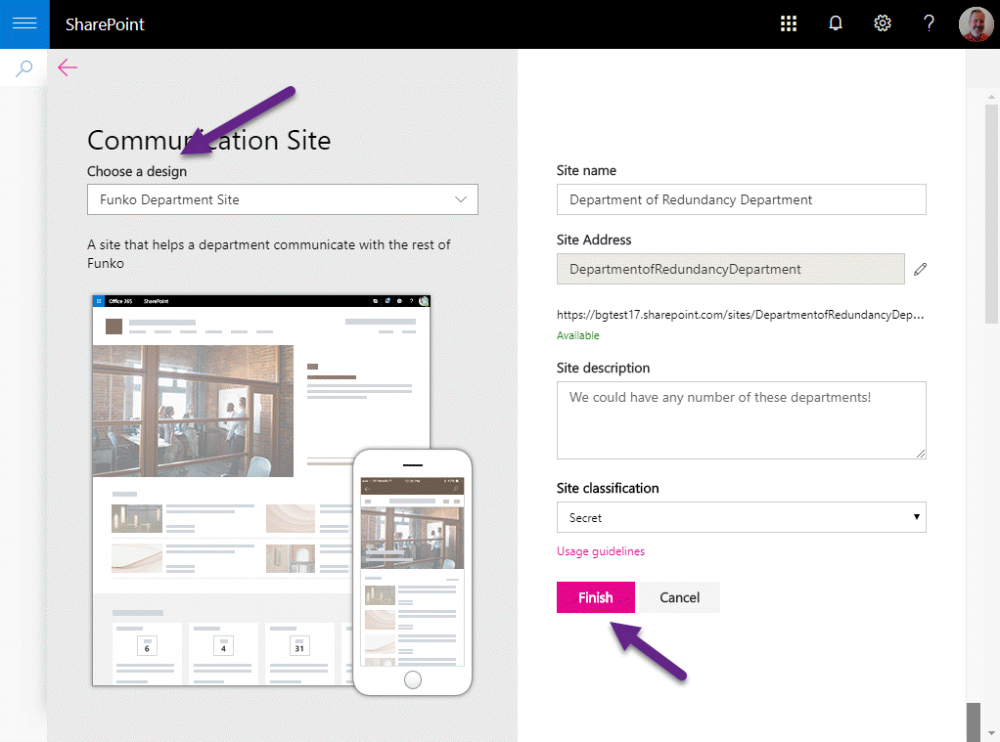

# Swooping into SharePoint Site Designs

Several months ago a group of SharePoint MVPs gathered to film a new kind of reality TV show and remake a company's Intranet. You may have seen it - [SharePoint Swoop](https://techcommunity.microsoft.com/t5/Microsoft-SharePoint-Blog/SharePoint-Swoop-the-intranet-makeover-show/ba-p/186892)!

This is a story from behind the scenes,in which I got to make their work reusable with SharePoint Site Designs and Scripts. It was quite a thrill to be involved, even though I wasn't there in person! I'll start with the story, then dig into the details of Site Designs and Scripts.

## SharePoint Swoop

SharePoint Swoop is a new kind of reality TV show. Makeover shows about physical things like fashion, homes, and restaurants have become hackneyed! It's time to make over our digital experiences, and SharePoint Swoop does just that.

SharePoint MVPs 
[Sue Hanley](https://twitter.com/susanhanley),
[Laura Rogers](https://twitter.com/WonderLaura), and
[Ben Nualin](https://twitter.com/bniaulin)
met with customer stakeholders and set out to remake their Intranet in only three days.

You can watch the series [here](https://aka.ms/SharePointSwoop) (binge watching encouraged!)

## The need for reuse

With only three days, the team had to stay focused. A product development team volunteered their department site for a remake, but what about the other departments? Wouldn't it be nice if you could push a button and make sites for the other departments based on the same design? Well here it is:

Naturally the customer wanted to base the new Intranet on SharePoint's new modern sites. They wanted their department sites to be Communication sites that included a Hero web part at the top of the home page, initially without images loaded; below that they wanted news on the left and frequently needed links on the right.  They also wanted to set up an About page, and a custom view of the Pages library to facilitate page management. The resulting site looks like this (before adding content):

When a user pushes the button, the Site Design runs and creates the site with the desired structure. Although Site Designs weren't yet released (even in preview), with the help of [Sean Squires](https://twitter.com/iamseansquires) and [Vesa Juvonen](https://twitter.com/vesajuvonen), it was all working before too long.

## Why Site Designs and Scripts?

Site Designs have several advantages over previous site provisioning techniques, including:

* They run server side, so they're faster than calling a client API's for each step of site creation
* They're repeatable, so you can run them again and again. When a site design is updated, just rerun it to bring the site up to the latest and greatest
* They're governed by permissions; IT can control who can create sites from each design
* A Site Design is made of _Site_ _Scripts_; this allows reusing parts of a site structure among multiple site designs. For example, if several types of sites need a certain list and views, that can be put in a separate site script and reused across all the designs

Site scripts are JSON files that contain _actions_, which can set up almost anything you'd want in a new site:

#### Site Settings
* addPrincipalToSPGroup
* addNavLink
* applyTheme
* setSiteLogo
* setRegionalSettings
* setSiteExternalSharingCapability
* triggerFlow
* joinHubSite

#### SharePoint Components
* createSPList
* addSPField
* deleteSPField
* addSPFieldXml
* createSiteColumn
* createSiteColumnXml
* addSiteColumn
* addContentType
* createContentType
* removeContentType
* addSPView
* removeSPView
* setSPFieldCustomFormatter

#### SharePoint Framework Solutions
* installSolution
* associateExtension
* associateListViewCommandSet
* associateFieldCustomizer 

If something is missing from this list, it's possible to trigger an Azure Function to do the work using a remote API such as [Graph API](https://developer.microsoft.com/en-us/graph/graph-explorer) or [PnP PowerShell](https://docs.microsoft.com/en-us/powershell/sharepoint/sharepoint-pnp/sharepoint-pnp-cmdlets?view=sharepoint-ps). This also allows IT shops to make a smooth transition from remote provisioning techniques like PnP PowerShell into Site Designs; portions of the provisioning process can be transitioned to Site Scripts over time.

By the way, Site Designs aren't just useful when sites are created. They can be applied and re-applied at any time using PowerShell or a REST API. And soon it will be possible to run them when sites are added to a Hub, so Hub-specific settings and content can be added to each site.

## Technical Details

This article won't go into all the technical nitty-gritty; for that please refer to [Building SharePoint Site Designs with Azure Functions](article2.md). It provides a walk-through of [the code](https://github.com/SharePoint/sp-dev-site-scripts/tree/master/samples/site-azure-function), along with installation instructions (yes the code is freely available so you can use it on your Intranet too!)

You will learn:

* How to create Site Designs and Site Scripts
* How to create a Theme and include include it in your Site Script
* How to trigger an Azure Function to run PnP PowerShell and add both custom and out-of-the-box web parts to a modern SharePoint page

Please check it out!