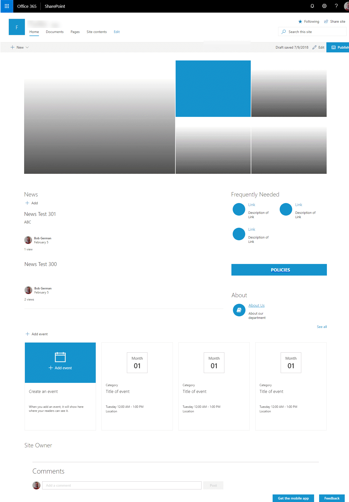

# Building SharePoint Site Designs with Themes and Azure Functions

This article is the sequel to [Swooping into SharePoint Site Designs](article1.md), in which I related my experience working behind the scenes on the world's first SharePoint reality show! This time I'll explain [the code](https://github.com/SharePoint/sp-dev-site-scripts/tree/master/samples/site-azure-function) so you can build similar solutions if you so desire.

The sample shows how to build a site design and script for a simple department site, as created in the [SharePoint Swoop video](https://techcommunity.microsoft.com/t5/Microsoft-SharePoint-Blog/SharePoint-Swoop-the-intranet-makeover-show/ba-p/186892). A team of experts worked with [Funko Toys](https://www.funko.com/) to redesign their Intranet site in just three days. This site design was developed behind the scenes to provide a template for Funko's department sites.

The sample shows how to:

* Create a Site Theme and include it in your site script
* Trigger a Microsoft Flow to call an Azure function to do things that aren't (yet?) supported by Site Designs; in this case, that includes placement of sections and web parts onto the home page, and creation of an About page
* Deploy site designs and scripts using PowerShell to inject environment-specific values such as the tenant name, logo URL, etc.

In addition to the sample's Site Design, Script, and Theme, you'll need to provision:

* a custom SharePoint Framework solution with web parts from the [Shire project](https://techcommunity.microsoft.com/t5/Microsoft-SharePoint-Blog/Best-practices-for-a-planning-and-building-a-modern-digital/ba-p/88638), which are included in the Department Site home page
* an Azure function containing the PnP PowerShell to add these web parts to the site home page
* an Azure Queue to trigger the Azure Function when an item is added by a Flow
* a Microsoft Flow that's started by the Site Script and queues the request

Here's the site design:



The home page includes a Hero web part at the top, initially without images loaded; below that there's news on the left and frequently needed links on the right.  The script also sets up  an About page, and a custom view of the Pages library to facilitate page management.

## The Site Script

Here's the Funko site script:

```JSON
{
    '$schema': 'schema.json',
    'actions': 
    [
        {
            'verb': 'setSiteLogo',
            'url': '${LogoUrl}'
        },
        {
            'verb': 'applyTheme',
            'themeName': '${ThemeName}'
        },
        {
            'verb': 'triggerFlow',
            'url': '${FlowTriggerUrl}',
            'name': 'Running Flow',
            'parameters': {
                'event': '',
                'product': ''
            }
        }
    ],
    'bindata': { },
    'version': 1
};
```

As you can see, a Site Script is made up of actions. What may not be obvious is that these actions are idempotent - that is, they can be run again and again and the result will be the same. Therefore, you can re-apply site scripts after the fact.

This site script has three actions: setSiteLogo, applyTheme, and triggerFlow. Since then, the SharePoint team has added more actions and some things I did manually could be included, such as installing the custom SPFx solution and adding views to the Pages library.

In the repo, you'll find this script embedded into the [Install-SampleSiteDesign.ps1](https://github.com/SharePoint/sp-dev-site-scripts/blob/master/samples/site-azure-function/Install-SampleSiteDesign.ps1) PowerShell script. That allowed me to insert parameters at runtime for use in different tenants, or for development, staging, and production use. More on that in Step 4!

The sections that follow will explain the major steps in installing the solution and highlight useful concepts along the way.

## Step 1: Set up the SharePoint Framework solution

This solution uses the Hub Links List and Hub Box Button web parts from the [Links and Handlebars web parts](https://github.com/SharePoint/sp-dev-solutions/tree/master/solutions/LinksAndHandlebarsTemplate), which are placed on the home page. Follow the instructions in the readme to install them, and ensure that they're installed as "tenant scoped" so they can be used on all sites. The package is already set to allow this; just make sure that when you add the web parts to your app catalog you check the "Make this solution available to all sites in the organization" check box. That way, when you create a new site, the web parts will already be available and ready to go.


You could, of course, skip this step and just remove the web parts from the Azure function that sets up the home page. But then you'd miss out on these cool, open source web parts!

## Step 2: Set up the Flow and Azure Function

A major requirement in the SharePoint Swoop project was to add web parts and sections to each department site in a consistent way. Since (at the time of this writing) this isn't supported by site designs and scripts, the solution is to use the PnP Provisioning Engine to perform those functions.

This solution is based on the documented process for [Calling the PnP Provisioning Engine from a site script](https://docs.microsoft.com/en-us/sharepoint/dev/declarative-customization/site-design-pnp-provisioning). Follow the steps in the article, adding information from this repo as follows:

* In the section, "Provision the SPFx solution", install the Links and Handlebars web parts instead of the ones in the article. (You may have already done that!)
* You can skip the section, "Create a PnP Provisioning template" as the template information is already in this repo
* In the section, "Finish the Azure Function", add the [Azure Function code](https://github.com/SharePoint/sp-dev-site-scripts/blob/master/samples/site-azure-function/SetupDepartmentSite/run.ps1) from this repo instead of the sample in the article. Make sure you set up the SPO_AppId and SPO_AppSecret application settings as explained in Step 4.
* You can skip the section "Create the Site Design" for now, as this is handled by the Install-SampleSiteDesign.ps1 PowerShell script in this repo

The Azure Function code is a single file, [Run.ps1](https://github.com/SharePoint/sp-dev-site-scripts/blob/master/samples/site-azure-function/SetupDepartmentSite/run.ps1) which uses [PnP PowerShell](https://docs.microsoft.com/en-us/powershell/sharepoint/sharepoint-pnp/sharepoint-pnp-cmdlets?view=sharepoint-ps) to set up the home page. The [other article](https://docs.microsoft.com/en-us/sharepoint/dev/declarative-customization/site-design-pnp-provisioning) called for using a Provisioning Template, which is a great approach. A Provisioning Template is an XML structure that PnP PowerShell can use to provision site content. 

Personally I like to code each thing I'm provisioning rather than use a template, and you'll see that here. One reason for this is it makes it easy to set web part properties programmatically; sometimes that's necessary to insert a list ID or something else unique to the target site. Another is just a personal preference to keep everything in my PowerShell script.

For example, here's the code to sec up the 2nd section on the home page, which has two columns with a news feed on the left and three of the custom web parts on the right.

```PowerShell

Add-PnPClientSidePageSection -Page "Home.aspx" `
    -SectionTemplate TwoColumnLeft -Order 2
Add-PnPClientSideWebPart -Page "Home.aspx" `
    -Section 2 -Column 1 -DefaultWebPartType NewsFeed
$props = '' # JSON removed for brevity
Add-PnPClientSideWebPart -Page "Home.aspx" -Section 2 -Column 2 `    -Order 1 -Component "Hub Links List" -WebPartProperties $props
$props = '' # JSON removed for brevity
Add-PnPClientSideWebPart -Page "Home.aspx" -Section 2 -Column 2 `
   -Order 2 -Component "Hub Box Button" -WebPartProperties $props
$props = "{'listQuery':'','title':'About','layoutMode':0,'hubLinksItems':[{'index':null,'Title':'About Us','URL':'${$webUrl}About.aspx','Description':'About our department','Icon':'fa-book','NewTab':false,'GroupBy':''}],'groups':[],'version':'1.0'}"
Add-PnPClientSideWebPart -Page "Home.aspx" -Section 2 -Column 2 `    -Order 3 -Component "Hub Links List" -WebPartProperties $props
Write-Output "Section 2 set up"


```

The $props vales contain the web part properties. To get these values, first place the web part on a page and configure it as you wish. Then put the page into [maintenance mode](http://www.aerieconsulting.com/blog/debug-modern-web-parts-using-maintenance-mode) by adding ?maintenanceMode=true on the query string. This will reveal the details of each web part. The JSON you need is under the Manifest tab.

One of the web parts has a link to the new About page, which is provisioned later on in the script. The URL will be different for every site, so a PowerShell variable is inserted as {$webUrl}. This is shown in the last web part added in the code above. For something like a modern List View web part, expect to do a lot more work gathering site, web, list, and view ID's and inserting them into the web part properties.


## Step 3: Install the SharePoint Theme

The repo includes a PowerShell script, [Install-SampleTheme.ps1](https://github.com/SharePoint/sp-dev-site-scripts/blob/master/samples/site-azure-function/Install-SampleTheme.ps1), to create a custom site theme. You may want to make a new theme for your site, or you can stick with the Funko colors (which are close but not quite the same as the SharePoint colors).

For example, if you want to call your theme DeptThemeSample, run this:

    .\Install-SampleTheme.ps1 `
      -Url https://<tenant>-admin.sharepoint.com `
      -ThemeName "DeptThemeSample"

The theme is just another JSON object:

```JSON
{
    "themePrimary" = "#1593cc";
    "themeLighterAlt" = "#f2fafe";
    "themeLighter" = "#e5f5fc";
    ...
    "bodyText" = "#333333";
    "disabledBackground" = "#f4f4f4";
    "disabledText" = "#c8c8c8";
}
```

You can easily generate your own theme using the [Office UI Fabric Theme Generator](https://developer.microsoft.com/en-us/fabric#/styles/themegenerator). Pick your colors, and copy the JSON output into Install-SampleTheme.ps1.

## Step 4: Install the Site Design and Site Script

The [Install-SampleSiteDesign.ps1](https://github.com/SharePoint/sp-dev-site-scripts/blob/master/samples/site-azure-function/Install-SampleSiteDesign.ps1) script contains the site script JSON and the PowerShell to set it up. To make the solution portable, all tenant-specific settings are parameters to the script, and some of them are added to the site script at runtime.

For example, you might call

    .\Install-SampleSiteDesign.ps1 `
      -Url https://<tenant>-admin.sharepoint.com `
      -LogoUrl "https://www.somewhere.com/companyLogo.jpg" `
      -ThemeName "DeptThemeSample" `
      -FlowTriggerUrl "https://(URL from step 14 of the Site Design PnP Provisioning article)"

Notice that the site script is right there in the PowerShell script. It uses [here-strings] (with @ symbols around the quotation marks)(https://blogs.technet.microsoft.com/heyscriptingguy/2015/12/31/powertip-use-here-strings-with-powershell/) which allow the JSON to span many lines; it's arranged so the JSON can just be pasted in. The here-string has double quotes, which allows variable substitution, such as inserting the site logo URL from the parameters:

```JSON
        {
            'verb': 'setSiteLogo',
            'url': '${LogoUrl}'
        },
```
With the site script JSON defined, the PowerShell goes on to add the site script and a site design which references it.

```PowerShell

Add-SPOSiteScript -Title $SiteScriptName `
    -Description $Description -Content $scriptJson
$siteScript = Get-SPOSiteScript | `
              Where-Object {$_.Title -eq $SiteScriptName} 
Add-SPOSiteDesign -Title $SiteDesignName -WebTemplate '68' `
    -SiteScripts $siteScript -Description $Description

```

Notice that the Add-SPOSiteDesign command is where you define the web template to use. Yes - this is the same [web template](https://blogs.msdn.microsoft.com/vesku/2010/10/14/sharepoint-2010-and-web-templates/) from SharePoint 2010! A Communication Site is web template 68; a modern Team site is 64. Those are the only two you're likely to use with site designs, at least until more modern web templates come along.

You can restrict who can use a Site Design with the [Grant-SPOSiteDesignRights](https://docs.microsoft.com/en-us/powershell/module/sharepoint-online/Grant-SPOSiteDesignRights?view=sharepoint-ps) PowerShell cmdlet.

With the new site design in place, you should be able to create a Communications Site from SharePoint Home and the Site Design should be an option. The site script triggers the Flow, which adds to the Azure Queue, which calls the Azure Function to populate the site home page.

## Reference

* [Create and use custom SharePoint site designs in Office 365](https://techcommunity.microsoft.com/t5/Microsoft-SharePoint-Blog/Create-and-use-custom-SharePoint-site-designs-in-Office-365/ba-p/143243)
* [SharePoint site design and site script overview](https://docs.microsoft.com/en-us/sharepoint/dev/declarative-customization/site-design-overview)
* [Get started creating site designs and site scripts](https://docs.microsoft.com/en-us/sharepoint/dev/declarative-customization/get-started-create-site-design)
* [SharePoint Site Script samples](https://github.com/SharePoint/sp-dev-site-scripts) (including this one)