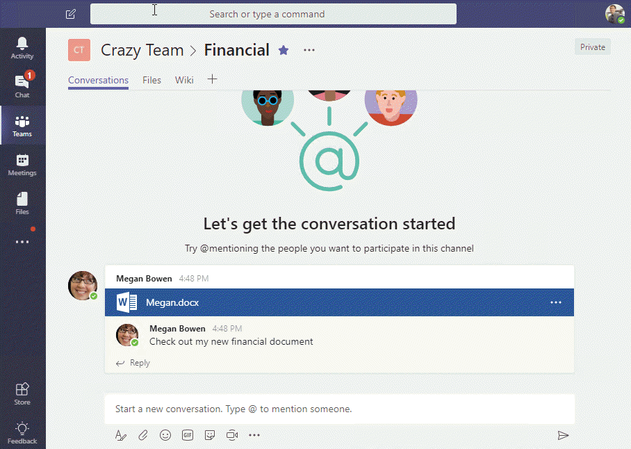
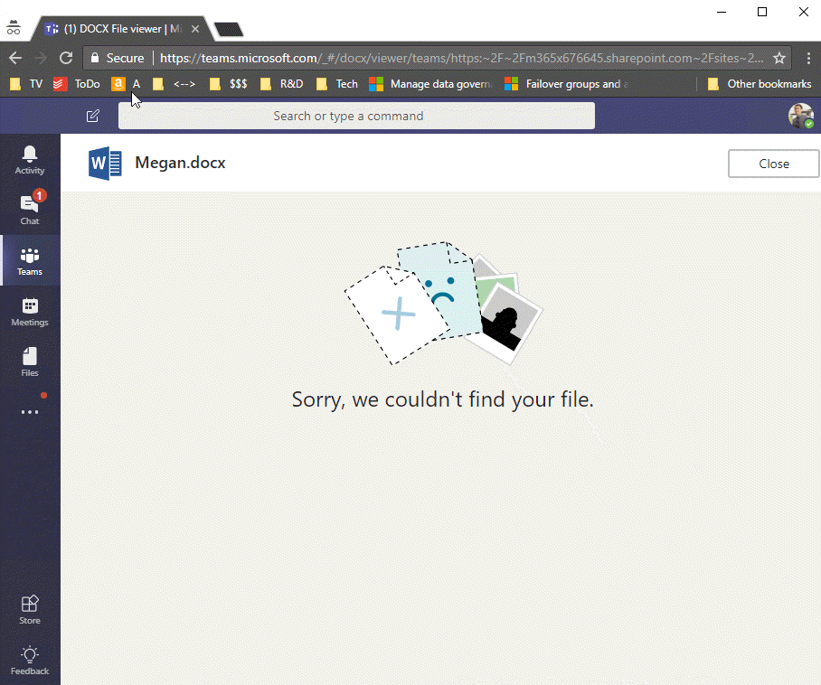
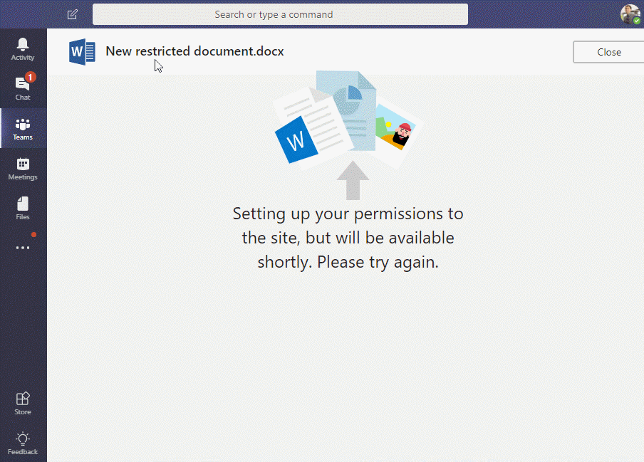

# Using SharePoint Permissions within Microsoft Teams

A lot of people have asked for "private channels" in Microsoft teams. Microsoft has stated publicly that they're working on it; there's even [a page](https://support.office.com/en-us/article/create-a-private-channel-in-teams-60ef929a-4d68-418b-bf4f-5784db184ec9) in the documentation all ready for when it comes along! 

In the meantime, a question came up about using SharePoint permissions to restrict the level of access to channel files. Recall that every Team has a SharePoint site, and the files in the Files tab land in a document library on that site. Each Teams channel gets a folder in that site. So is it possible to make a "semi-private" channel by simply modifying the folder permissions in SharePoint? The idea is that while the conversation might be open, the files are only available to a subset of team members.

Today I set about testing it, and it seemed to work pretty well! I tested it with two hypothetical users, Megan and Alex. Megan provisioned a Team with two channels, General and Finance. She invited Alex to the Team, but she went into SharePoint and modified the permissions. Specifically, she broke inheritance on the Finances folder (files in the Finances channel) and gave permission only to herself and one other user; Alex was to have no access. She also created a Restricted subfolder in the General channel's folder, and set permission to keep Alex out. Then she added files to each folder, so we can see if Alex can access those files.

What I found was that Alex could work with files in the General channel, but he didn't see the Restricted folder there. The Files tab in the Finance channel appeared to be empty, even though Megan could work with the files there.

When Megan mentioned a file in the Finances channel, Alex could see that clearly.

_Megan mentions a file in the Finances channel_

But when Alex clicked on the file link he got an error.

_Alex tries to open a file mentioned in the conversation, but he doesn't have access in SharePoint_

I tried the same thing with a file in the Restricted folder under the General channel. This time I got a different error.

_Alex tries to open a file mentioned in the conversation, but he doesn't have access in SharePoint_

While the error implies that Alex might someday get access, so far he still hasn't, and he can easily access files that aren't in the Restricted folder, so I'm thinking that it's just a misleading error message.

There's no way for Alex to try and create a file in the Restricted folder, since it's hidden, but what if he goes into the Finances channel, which appears to have no files, and tries creating one there? He gets a different error.

_Alex tries to create a new file in the Finances channel_

## Conclusion

Based on this testing, it appears that you can effectively secure files within a channel, even if you can't yet restrict access to the rest of the channel. The user may get confused trying to create a file or click on a file linked from a conversation, but he or she won't get access to the file or folder in question.

