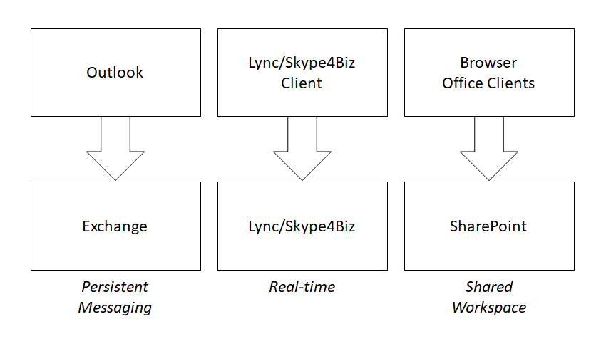

# Teams and SharePoint: Better Together

## Collaboration Silos

Traditionally, our collaboration tools have been divided into silos based on the mode of communication. In the Microsoft space, we've used Outlook and Exchange for persistent messaging,Skype for Business for real-time communication, and SharePoint to provide a workspace where we can share documents and other information.

These tools work together to provide for our communications needs, whether they're real-time, message based, or documents and other content. They work well together, but they're still separate programs we have to run, and constantly flip between. As we do, the information is organized differently in each tool: most of us view email by date, Skype by person, and SharePoint by project or team. That's a lot of context switching. Of course we're all used to this, and probably don't even notice how much of our attention goes into it.

Microsoft Teams brings all these modes of communication under a single "pane of glass", so we can focus on collaboration rather than collaboration tools. For certain kinds of communication - specifically anything involving a team of people - it's a lot easier than flipping between three different tools.

## How did we get here?

Most electronic communication and collaboration tools have evolved from the real world. Mail was the first to make the leap from real world to online when, in 1971 at BBN, Ray Tomlinson combined features of two pre-Internet programs, SNDMSG and CPYNET, to send the first email. In doing so, he condemned all of us to endless hours of sisyphisian effort to get our inboxes under control.  One by one, electronic implementations of the other ways of communicating came along, as shown in Table 1.

| Real world | Electronic	| Characteristics | Product |

| --- |:---:| ---:|

| Mail | Email | Persistent messaging | Exchange |

| Telephone, telegraph, pagers | Chat, voice, video, conferencing | Real-time communication | Skype for Business |

| Paper: files, documents, pages, bulletin boards, newspapers |Shared workspaces | Shared storage and presentation | SharePoint |

This led to a world where our collaboration products all had real-world metaphors, with their incumbent limitations. In the Microsoft world, Exchange gave us persistent messages, Skype handled real-time communication, and SharePoint provided shared workspaces. Meanwhile, back in the real world, teams of people needed all these things, and juggled all these tools to get their work done.

Having to juggle three or more tools isn't ideal but it's not horrible. Microsoft made it easier by integrating both Lync/Skype and SharePoint with the Exchange client program Outlook, so you could view files, emails, and archived Skype conversations all in one place. The fatal flaw, really, is the way these tools organized information.

Like their real-world forebears, email and real-time communication tools are organized by _recipient_; that is, communications are delivered to a person or a group of people sharing an inbox or other endpoint. That leads us immediately to chaos, where communications from everywhere about every topic lands in a big heap on the doorstep. That's why email is so painful! Years ago I gave up trying to separate my email into folders by topic, and turned from "filer" to "piler", so now I rely on search when I need to find an email/needle in my inbox/haystack.

Shared workspaces are different because they're organized by _topic_ rather than by recipient. Let's share everything about Project X here, and everything about Topic Y over there. You might end up with a big heap of information, but it won't be random, it will all be related to the topic of the shared workspace in some way, which is a big help!

Teams, and other tools like it, are the first to really combine all these modes of communication. Together, the three modes end up looking like a shared workspace which allows persistent and real-time communications.

OK SO TEAMS IS WONDERFUL, BUT WHAT DOES THAT HAVE TO DO WITH SHAREPOINT?

Well, SharePoint was designed to provide topic-focused shared workspaces, so of all the amazing stuff behind Teams, SharePoint reflects Teams' structure the best. 

Mail and real-time are focused on senders and receivers
Only the 
