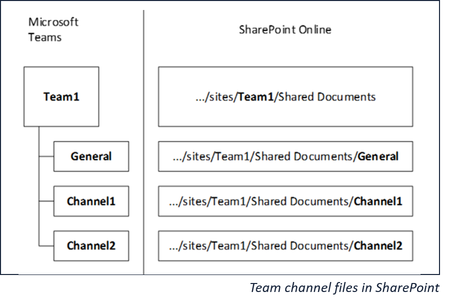
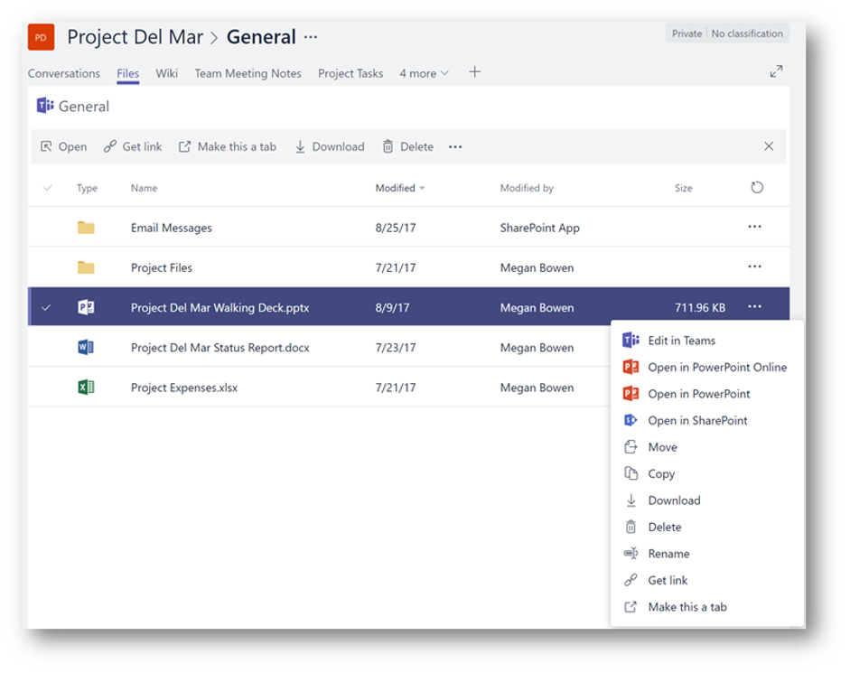
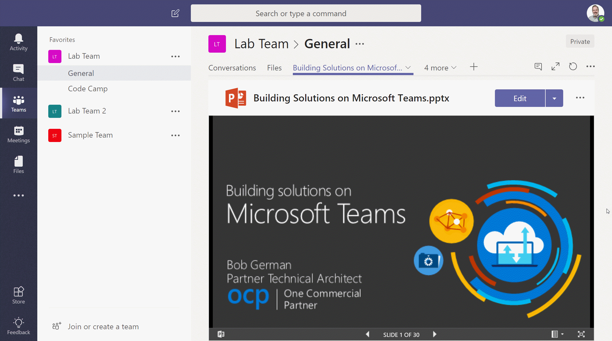

# Teams and SharePoint: Better Together

## Collaboration Silos

Traditionally, our collaboration tools have been divided into silos based on the mode of communication. In the Microsoft space, we've used Outlook and Exchange for persistent messaging, Skype for Business for real-time communication, and SharePoint to provide a place to share documents and other information.

These tools work together to provide for our communications needs, whether they're real-time, message based, or documents and other content. They work well together, but they're still separate programs we have to run, and constantly flip between. As we do, the information is organized differently in each tool: most of us view email by date, Skype by person, and SharePoint by project or team. That's a lot of context switching. Of course we're all used to this, and probably don't even notice how much of our attention goes into it.

Microsoft Teams aligns all these modes of communication under a single "pane of glass", so we can focus on collaboration rather than collaboration tools. For certain kinds of communication - specifically anything involving a team of people - it's a lot easier than juggling multiple tools.

## How did we get here?

Most electronic communication and collaboration tools have evolved from the real world. Mail was the first to make the leap from real world to online when, in 1971 at BBN, Ray Tomlinson combined features of two pre-Internet programs, SNDMSG and CPYNET, to send the first email. One by one, electronic implementations of the other ways of communicating came along, as shown in the table below.

<table>

<tr><th>Real world</th><th>Electronic</th><th>Characteristics</th><th>Product</th></tr>

<tr><td>Mail</td><td>Email</td><td>Persistent messaging</td><td>Exchange</td></tr>

<tr><td>Telephone, telegraph, pagers</td><td>Chat, voice, video, conferencing</td><td>Real-time communication</td><td>Skype for Business</td></tr>
<tr><td>Paper: files, documents, pages, bulletin boards, newspapers</td><td>Shared workspaces</td><td>Shared storage and presentation</td><td>SharePoint</td></tr>

</table>

This led to a world where our collaboration products are metaphors for things in real world, along with their incumbent limitations.

Like their real-world forebears, email and real-time communication tools are organized by _recipient_; that is, communications are delivered to a person or a group of people sharing an inbox or Skype identity. If that recipient is a modern information worker, this soon leads to chaos, as communications from everywhere about every topic piles up in a big heap on the doorstep. No wonder keeping up with email is such a sisyphean effort! 

Shared workspaces are different because they're organized by _topic_ rather than by recipient. Let's share everything about Project X here, and everything about Topic Y over there. You might end up with a big heap of information, but it won't be random, it will all be related to the topic of the shared workspace in some way, which is a big help!

## A new generation of collaboration tools

Teams, and other tools like it, align all forms of communication to topics instead of individual people. This has a number of benefits:

* When you're focused on a task, everything you need is likely to be in the same place: messages, meetings, notes, documents, are all in the same place, along with immediate real-time access to teammates who are online
* You can work "in the open", eliminating the need for extra emails. For example, when you upload a document to Teams, a notification is automatically shown in the channel so everybody knows about it; no need to send an email announcement, or an email asking where the document is.
* The team can have a conversation right in the channel about the information there, eliminating the need to send links to information into Outlook or Skype (or worse, to attach duplicate copies)

Working day to day in Teams feels a lot more streamlined, and is a welcome change from the traditional tool set.

## So how does this relate to SharePoint?

Both Teams and SharePoint team sites are organized by topic, project, organization, or some other focal point for a team of people. Hence, in any given organization, Teams and channels will often follow a similar structure to SharePoint team and project sites.

In fact, this is inherent in the design. Every Microsoft Team automatically has a modern SharePoint team site associated with it; that's where channel documents are stored. Each channel is associated with a folder in the SharePoint site's document library. In addition, files sent between users outside of a Teams channel are stored in the sender's OneDrive for Business folder.

As [Mark Kashman](https://twitter.com/mkashman) pointed out in [this recent Teams on Air episode](https://techcommunity.microsoft.com/t5/SharePoint-Blog/Teams-on-Air-replay-Microsoft-Teams-plus-SharePoint-in-Office/ba-p/183257), there are a number of advantages to storing Teams documents in SharePoint and OneDrive for Business:

* The OneDrive sync client works  on Windows or Mac, so it's easy to sync all the files for a Team
* Document co-authoring and and the online versions of Office applications depend on two special protocols ([WOPI](https://msdn.microsoft.com/en-us/library/hh641756(v=office.12).aspx) and [FSSHTTP](https://msdn.microsoft.com/en-us/library/dd956775(v=office.12).aspx)); since they're built into SharePoint and OneDrive, they also work in Teams
* SharePoint provides previews for more than [300 file types](???), which are displayed directly in the Teams file tab
* SharePoint and OneDrive have comprehensive data governance and compliance features, so Teams documents are protected as well. These include:
   * Automatic classification and labelling
   * Data loss prevention
   * Document retention policies, disposition review, and event-baed retention
   * eDiscovery and legal holds
* Files are discoverable in Delve and SharePoint search

Users don't have to leave Teams to work with their files; they appear in the Files tab. There's an "Open in SharePoint" option that brings you right into the SharePoint site.

## SharePoint Pages in Teams

It's also possible to add SharePoint pages as tabs in Teams. This provides a much easier approach to building tabs compared with the [typical approach](???) of building a custom website from scratch. All the information on a team site home page can appear there, providing the best of both SharePoint and Teams in the same user interface.

It's also possible to put a whole document in a tab. This can be useful, for example, to share a key presentation or to track information in a spreadsheet that's easily accessed by the whole team.

)

## SharePoint News in Teams

There have been a number of (mostly failed) attempts at bringing conversations into SharePoint. Discussion lists and news feeds were part of the product; a number of 3rd party offerings have worked to address this as well. Many of the more successful 3rd party offerings focus on the ["outer loop"](???) of communication - that is, broader corporate communication.

For the "inner loop", Teams puts the conversation on center stage, which makes a lot of sense; SharePoint augments this with documents and other shared information. 

But what about team news that transcends the conversation? Perhaps a new phase of a project is starting, or you want to highlight a success. Those things could easily be lost in the Teams conversation thread, but SharePoint news is a perfect vehicle for those kinds of messages.

Modern SharePoint sites include a light-weight publishing system for news pages. These pages bubble up on web parts, in Hub sites, on the SharePoint Home page, in the SharePoint mobile app, and now in Teams as well. When a news item is posted, it's ???? 

## Adding Teams to a SharePoint Team site

You can even [add a Team](https://techcommunity.microsoft.com/t5/Microsoft-Teams/How-to-connect-a-quot-Team-quot-to-a-quot-Group-quot/td-p/27861) to an existing SharePoint team site, as long as it's [modern](https://techcommunity.microsoft.com/t5/SharePoint-Blog/What-is-Modern-SharePoint-and-Why-Should-I-care/ba-p/161941) (actually you're adding the Team to the site's Office 365 Group). Soon it will be possible to add a Group to a classic SharePoint Team site, so those will be able to have Teams as well.